<p align="center">
  <strong>LiveSync</strong><br/>
  Multi-tenant SaaS **support desk** with database-per-tenant isolation,<br/>
  DDD aggregates (Queues + Tickets), CQRS, real-time SignalR sync, and tenant admin console.
</p>

<p align="center">
  <a href="https://github.com/ismayilov449/LiveSync/actions/workflows/ci.yml"></a>
  
  
  
  
  
  
</p>

---

## Table of contents

- [At a glance](#at-a-glance)
- [Live demo](#live-demo)
- [Why this project exists](#why-this-project-exists)
- [Architecture](#architecture)
- [Real-time sync](#real-time-sync)
- [Multi-tenancy](#multi-tenancy)
- [Admin UI](#admin-ui)
- [Security & RBAC](#security--rbac)
- [Observability](#observability)
- [Solution architecture](#solution-architecture)
- [Tech stack](#tech-stack)
- [Project structure](#project-structure)
- [Quick start](#quick-start)
- [Hands-on demo scenarios](#hands-on-demo-scenarios)
- [API reference](#api-reference)
- [Testing](#testing)
- [Docker](#docker)
- [Configuration](#configuration)
- [Design decisions](#design-decisions)
- [Documentation index](#documentation-index)
- [For reviewers & interviewers](#for-reviewers--interviewers)
- [License](#license)

---

## At a glance

| Question | Answer |
|----------|--------|
| **What is it?** | A portfolio-grade **multi-tenant SaaS backend** with a React SPA. |
| **What problem does it solve?** | Teams need **isolated help desks** *and* **live ticket updates** when anyone opens, comments, or changes status. |
| **How is data isolated?** | **Database per tenant** + control plane for users/tenants/audit. |
| **How is live sync done?** | Domain events → change queue → worker → Redis → **bucket-scoped SignalR push** (Tickets vs Queues). |
| **What else is included?** | Tenant admin console, audit log, suspend/reactivate, idempotency, per-tenant rate limits, Prometheus metrics. |
| **What should I run first?** | [Quick start](#quick-start) → [Scenario: two users, one tenant](#scenario-two-users-one-tenant-live-sync) · [Glossary](docs/glossary.md) |

**30-second pitch:**  
*Register creates a new organization (tenant) with its own SQL database. Users share **queues** and **tickets** with a strict status lifecycle. Comments live inside the ticket aggregate. When anyone changes a ticket, subscribed tabs patch in place via SignalR. Tenant admins manage users, audit, queue health, and organization lifecycle.*

---

## Live demo

### Support desk UI

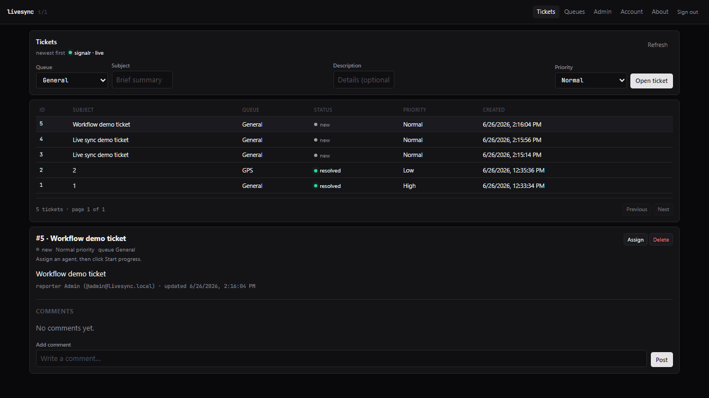

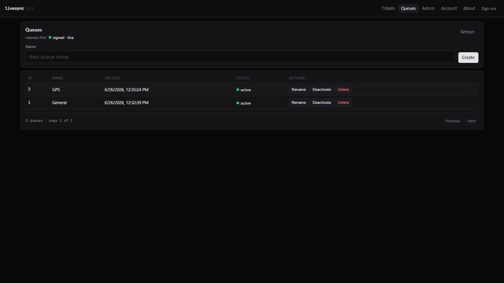

### Real-time sync — two users, same tenant

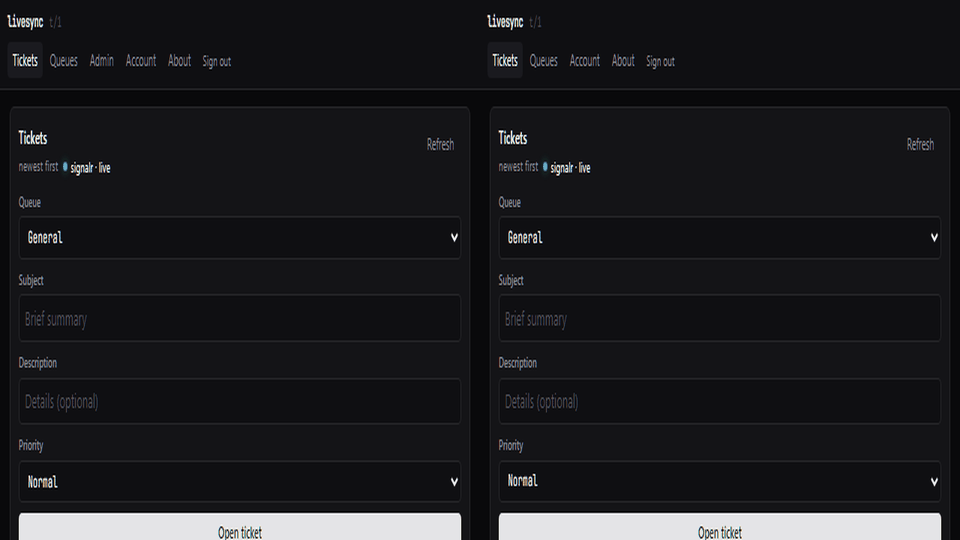

*Left: tenant admin · Right: member user · Same tenant (`t/1`) · Ticket rows and comments sync via bucket-scoped SignalR.*

### Ticket workflow

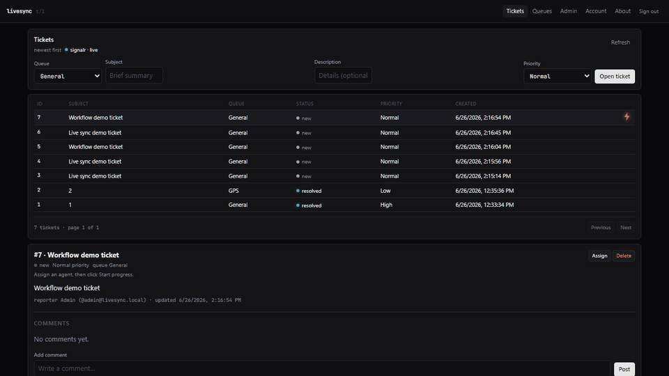

### Tenant isolation

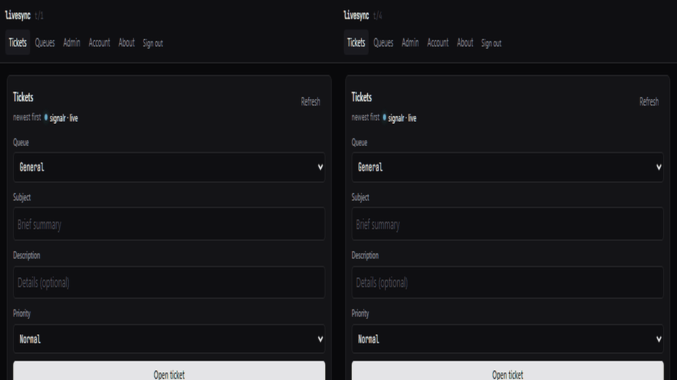

*Left: tenant 1 · Right: newly registered tenant 2 · Database-per-tenant isolation.*

### Admin console

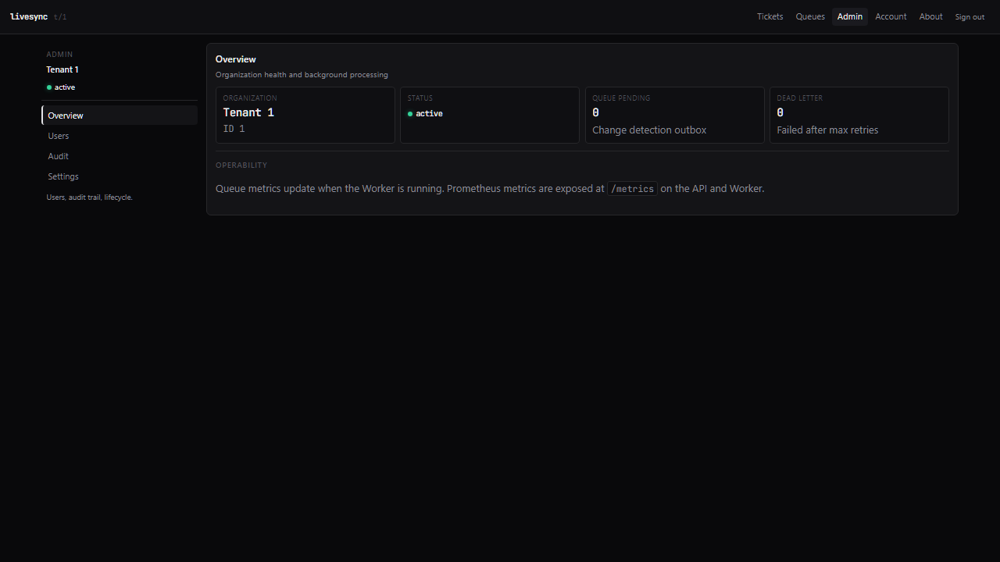

### Architecture overview

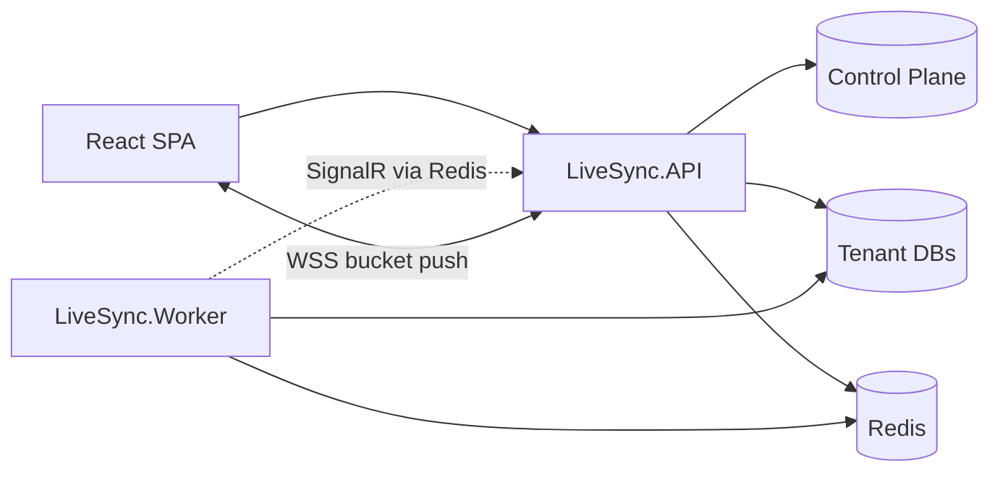

Re-record assets anytime: `python scripts/capture-demo-assets.py` (API + Worker + Docker required). See [docs/assets/README.md](docs/assets/README.md).

---

## Why this project exists

Most CRUD demos stop at REST + React. LiveSync goes further to show patterns used in **production multi-tenant B2B SaaS**:

1. **Tenant isolation** — not just a `TenantId` column, but separate databases per customer.
2. **Clean architecture** — Domain, Application, Infrastructure, host projects.
3. **CQRS + domain events** — commands mutate state; events trigger side effects.
4. **Reliable real-time** — outbox-style change queue with dead-letter handling.
5. **Operational maturity** — Prometheus metrics, OTLP, health checks, structured logging, integration tests.
6. **API platform basics** — rate limits, idempotency, audit log, tenant lifecycle.
7. **Tenant admin UX** — console for users, audit, queue stats, suspend/reactivate.
8. **DDD support desk** — Queue and Ticket aggregates with status machine, comments inside the ticket, and cross-aggregate validation.

If you're evaluating this repo for a role: start with the [demo walkthrough](docs/demo-walkthrough.md), then skim [architecture.md](docs/architecture.md).

---

## Architecture

### System context

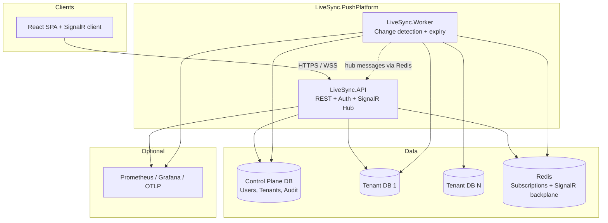

### Component responsibilities

| Component | Responsibility | Does NOT |
|-----------|----------------|----------|
| **LiveSync.API** | REST `/api/v1/*`, JWT auth, React SPA, SignalR `/hubs/push`, immediate tenant push, audit/lifecycle/ops APIs, `/metrics` | Run change-detection loop (by default) |
| **LiveSync.Worker** | Poll `ChangeQueue`, dead-letter after max retries, update Redis caches, tenant SignalR push, subscription TTL cleanup, `/metrics` on `:5260` | Serve HTTP API to browsers |
| **Control plane DB** | `Tenants`, ASP.NET Identity, `AuditEvents` | Store business tickets/queues |
| **Tenant DBs** | `Queues`, `Tickets`, `TicketComments`, `ChangeQueue`, `IdempotencyRecords` | Store users from other tenants |
| **Redis** | Subscription registry, topic cache, SignalR scale-out backplane (Polly resilience) | Primary persistence |

### Layering (Clean Architecture)

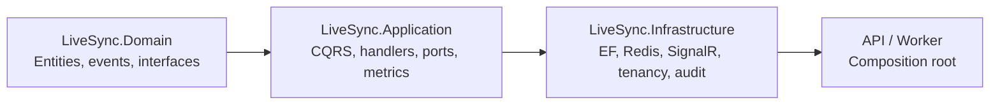

| Layer | Examples |
|-------|----------|
| **Domain** | `Queue`, `Ticket` (+ `TicketComment` entity), domain events, status machine |
| **Application** | `OpenTicketCommandHandler`, `AssignTicketCommandHandler`, `SubscriptionManager`, `IRealTimeNotifier`, `LiveSyncMetrics` |
| **Infrastructure** | `TicketRepository`, `QueueRepository`, `RedisSubscriptionStore`, `AuditService`, `SqlIdempotencyStore` |
| **API** | Controllers, middleware, JWT, SPA static files |
| **Worker** | Hosted services for change detection and queue metrics |

---

## Real-time sync

This is the **most interesting part** of the codebase.


See also: [docs/real-time-sync.md](docs/real-time-sync.md) · [ADR 005 — multi-bucket sync](docs/adr/005-multi-bucket-real-time-sync.md)

### What happens when a user opens a ticket?

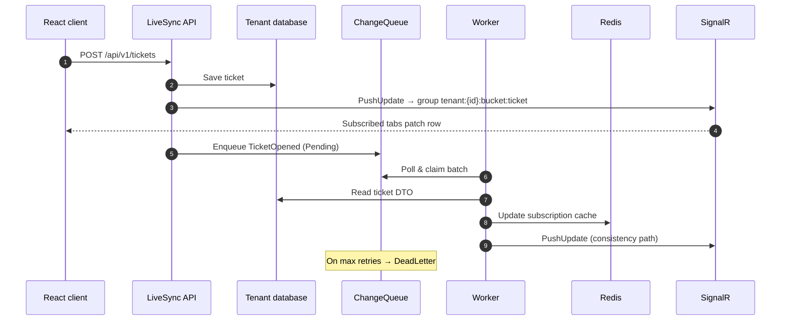

**Two push paths (intentional):**

| Path | Latency | Role |
|------|---------|------|
| **API immediate** | ~milliseconds | Users see changes instantly |
| **Worker queue** | ~1 second poll | Redis cache + subscription consistency |

Connections join SignalR group `tenant:{tenantId}:bucket:{ticket|queue}` on subscribe — Tickets page ignores Queue-only pushes. See [ADR 005](docs/adr/005-multi-bucket-real-time-sync.md).

Deep dive: [docs/real-time-sync.md](docs/real-time-sync.md)

---

## Multi-tenancy


### Model: database per tenant

```
LiveSync_ControlPlane          LiveSync_Tenant_1        LiveSync_Tenant_2
├── Tenants                    ├── Queues               ├── Queues
├── AspNetUsers (TenantId)     ├── Tickets              ├── Tickets
├── AspNetRoles                ├── TicketComments       ├── TicketComments
└── AuditEvents                ├── ChangeQueue          ├── ChangeQueue
                               └── IdempotencyRecords   └── IdempotencyRecords
```

| Concept | Detail |
|---------|--------|
| **Register** | `POST /api/v1/auth/register` → **new tenant** + `TenantAdmin` + new database |
| **Invite** | `POST /api/v1/auth/users` → new user in **caller's tenant** (admin only) |
| **Suspend** | `POST /api/v1/tenants/suspend` → blocks API access (403); reactivate still allowed |
| **Ticket IDs** | Per-tenant — ticket `5` in tenant 1 ≠ ticket `5` in tenant 2 |
| **Default queue** | Auto-created per tenant: **General** |

### Request pipeline

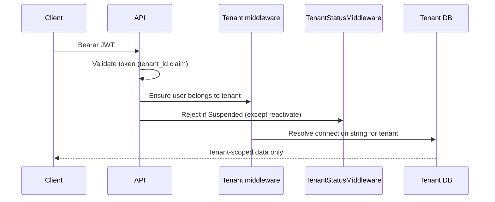

Details: [docs/tenancy.md](docs/tenancy.md) · ADR: [docs/adr/001-database-per-tenant.md](docs/adr/001-database-per-tenant.md)

---

## Admin UI


Tenant administrators (`TenantAdmin` role) see an **Admin** link in the header. The console uses a compact dark UI with monospace accents for technical data.

| Route | Purpose |
|-------|---------|
| `/admin/overview` | Organization name, status, change-queue pending / dead-letter counts |
| `/admin/users` | Invite users; list available via `GET /auth/users` for assignee picker |
| `/admin/audit` | Paginated audit log (create, update, delete, suspend, etc.) |
| `/admin/settings` | Suspend or reactivate the organization (with confirmation) |

**Account** (`/profile`) shows the signed-in user's profile, organization name, and tenant status — available to all authenticated users.

**Data pages:** `/tickets` and `/queues` — support desk with SignalR live status, row-level push, remote-change flash icons.

`GET /api/v1/auth/me` returns `tenantName` and `tenantStatus` for the sidebar and status chips.

---

## Security & RBAC

| Role | Tickets (open, comment, workflow) | Assign / delete ticket | Invite users | Admin console |
|------|-----------------------------------|------------------------|--------------|---------------|
| **TenantAdmin** | ✅ | ✅ | ✅ | ✅ |
| **TenantUser** | ✅ | ❌ | ❌ | ❌ |

- **Auth:** ASP.NET Identity + JWT (`tenant_id`, `user_id`, role claims)
- **API versioning:** `/api/v1/...` (+ legacy `/api/...` aliases)
- **Rate limiting:** auth endpoints (30/min per IP); authenticated API (200/min per tenant, configurable)
- **Idempotency:** `Idempotency-Key` header on `POST /tickets`
- **Suspended tenants:** 403 on all routes except `POST /api/v1/tenants/reactivate`
- **Errors:** RFC 7807 ProblemDetails
- **Dev only:** header auth fallback, `POST /api/v1/auth/dev/users` — disabled outside Development

---

## Observability

### Metrics (built-in)

| Endpoint | Port | Content |
|----------|------|---------|
| API `/metrics` | 5252 | Prometheus scrape |
| Worker `/metrics` | 5260 | Prometheus scrape |

Custom metrics (Prometheus names use underscores):

| Metric | Description |
|--------|-------------|
| `livesync_change_queue_depth` | Pending outbox entries (all tenants) |
| `livesync_change_queue_dead_letter_depth` | Dead-letter entries |
| `livesync_changes_processed` | Successfully processed changes |
| `livesync_changes_failed` | Retriable failures |
| `livesync_changes_dead_lettered` | Moved to dead-letter |
| `livesync_signalr_pushes` | SignalR notifications sent |
| `livesync_changes_processing_duration_ms` | Processing time histogram |

### Optional local stack

```bash
cd observability
docker compose -f docker-compose.observability.yml --profile observability up -d
```

| Service | URL | Notes |
|---------|-----|-------|
| **Prometheus** | http://localhost:9090 | Query `livesync_change_queue_depth`; check **Status → Targets** |
| **Grafana** | http://localhost:3000 | Login `admin` / `admin`; add Prometheus datasource `http://prometheus:9090` |
| **OTLP collector** | `localhost:4317` (gRPC) | Set `Observability:Otlp:Endpoint` in `appsettings.json` |

> OTLP is **not** a browser URL — it receives traces/metrics from the API and Worker.

Admin **Overview** shows queue pending/dead-letter counts via `GET /api/v1/operations/change-queue`.

---

## Solution architecture

This repo is structured to demonstrate **solution architect** thinking — not only working code.

### Architecture deliverables

| Artifact | Purpose |
|----------|---------|
| [docs/solution-architecture.md](docs/solution-architecture.md) | **C4 diagrams**, NFRs, quality attributes, platform waves, risk register |
| [docs/adr/](docs/adr/) | Architecture Decision Records (why, not just what) |
| [docs/resume-bullets.md](docs/resume-bullets.md) | Copy-paste **CV / LinkedIn bullets** tied to this codebase |

### Highlight bullets (solution architect)

- **Multi-tenant isolation** — database-per-tenant with control plane; JWT tenant boundary; ADR-documented trade-offs
- **Split deployment** — stateless API + background Worker; independent scaling and failure domains
- **Reliable real-time** — transactional outbox + dead-letter + immediate API push + worker consistency path
- **Collaborative UX** — bucket-scoped SignalR groups (Tickets vs Queues)
- **Operability** — Prometheus metrics, OTLP hooks, health probes, structured logging, CI with integration tests
- **Governance** — versioned API, RBAC, per-tenant rate limits, audit log, idempotency, tenant lifecycle, admin console

Full C4 + NFRs: **[docs/solution-architecture.md](docs/solution-architecture.md)**

---

## Tech stack

| Area | Technologies |
|------|----------------|
| **Runtime** | .NET 10, C# 13 |
| **API** | ASP.NET Core, EF Core 10, MediatR, FluentValidation |
| **Auth** | ASP.NET Identity, JWT Bearer |
| **Real-time** | SignalR, Redis backplane, StackExchange.Redis, Polly |
| **Frontend** | React 19, TypeScript, Vite, SignalR client, JetBrains Mono |
| **Data** | SQL Server (control plane + per-tenant DBs) |
| **Testing** | xUnit, FluentAssertions, Moq, Testcontainers |
| **Ops** | Docker Compose, GitHub Actions, Serilog, OpenTelemetry, Prometheus |

---

## Project structure

```
LiveSync.PushPlatform/
├── LiveSync.Domain/              # Entities, domain events, value objects
├── LiveSync.Application/         # CQRS handlers, real-time sync, metrics, ports
├── LiveSync.Infrastructure/      # EF Core, Redis, SignalR, tenancy, audit, worker services
├── LiveSync.API/                 # REST API, auth middleware, React SPA (client/)
│   └── client/                   # Vite + React source (builds to wwwroot/)
├── LiveSync.Worker/              # Change detection, dead-letter, subscription expiry
├── LiveSync.Tests/               # Unit tests (10)
├── LiveSync.IntegrationTests/    # Testcontainers + WebApplicationFactory (14)
├── docs/                         # Architecture, walkthrough, ADRs, glossary
├── scripts/                      # dev.ps1, dev.sh quick-start
├── observability/                # Prometheus, Grafana, OTLP collector compose
├── docker-compose.yml            # SQL Server + Redis (+ full profile)
├── Dockerfile.api
└── Dockerfile.worker
```

---

## Quick start

### Prerequisites

- [.NET 10 SDK](https://dotnet.microsoft.com/download)
- [Node.js 20+](https://nodejs.org/)
- [Docker Desktop](https://www.docker.com/products/docker-desktop/) (SQL Server + Redis)

### 1. Clone & infrastructure

```bash
git clone https://github.com/ismayilov449/LiveSync.git
cd LiveSync/LiveSync.PushPlatform
docker compose up -d
```

**Or use the dev script:** `.\scripts\dev.ps1` (Windows) / `./scripts/dev.sh` (Linux/macOS) — starts Docker, builds client, launches API + Worker.

> **Troubleshooting:** [docs/troubleshooting.md](docs/troubleshooting.md) · **Docker config:** copy `LiveSync.API/appsettings.Development.docker.example.json` if needed.

### 2. Build frontend (required — `wwwroot/` is not committed)

```bash
cd LiveSync.API/client
npm install
npm run build
cd ../..
```

### 3. Run API

```bash
dotnet run --project LiveSync.API
```

| URL | Purpose |
|-----|---------|
| http://localhost:5252 | App + API |
| http://localhost:5252/scalar/v1 | OpenAPI (Development) |
| http://localhost:5252/metrics | Prometheus metrics |

### 4. Run Worker (recommended)

```bash
dotnet run --project LiveSync.Worker
```

Worker metrics: http://localhost:5260/metrics

### 5. Login (seeded dev user)

| Field | Value |
|-------|-------|
| Email | `admin@livesync.local` |
| Password | `Admin123!` |
| Tenant | `1` |

### Optional: Vite dev server

```bash
cd LiveSync.API/client && npm run dev
```

→ http://localhost:5173 (proxies API + SignalR to port 5252)

### Optional: Observability stack

```bash
cd observability
docker compose -f docker-compose.observability.yml --profile observability up -d
```

---

## Hands-on demo scenarios

Full scripted guide: **[docs/demo-walkthrough.md](docs/demo-walkthrough.md)**

### Scenario: Two users, one tenant (live sync)


1. Login as **admin** in a normal browser tab.
2. **Admin → Users** — invite a member user.
3. Open **incognito** → login as member.
4. Both tabs → **Tickets** → confirm **signalr · live** (green dot).
5. Open a ticket or add a comment in either tab → **both Tickets tabs update** (row patch).
6. Open **Queues** in one tab, **Tickets** in the other — ticket changes do **not** refresh Queues (bucket isolation).

This proves: shared tenant DB + bucket-scoped SignalR + row-level client patch.

### Scenario: Tenant isolation


1. **Register** a new organization (creates tenant 2).
2. Tickets from tenant 1 are invisible in tenant 2.

### Scenario: RBAC


- Member can open tickets, comment, and advance workflow (start/resolve/close).
- Member cannot assign or delete tickets — admin only.
- Member does not see **Admin** nav.

### Scenario: Tenant admin

1. **Admin → Overview** — change-queue pending / dead-letter (with Worker running).
2. **Admin → Audit** — see ticket open/assign/comment entries.
3. **Admin → Settings** — suspend tenant, then reactivate.

---

## API reference

Base path: `/api/v1` (aliases: `/api/...`)

### Auth

| Method | Path | Auth | Description |
|--------|------|------|-------------|
| `POST` | `/auth/register` | Anonymous | New tenant + admin |
| `POST` | `/auth/login` | Anonymous | JWT token |
| `POST` | `/auth/users` | TenantAdmin | Invite user to tenant |
| `GET` | `/auth/users` | Bearer | List users in caller's tenant |
| `GET` | `/auth/me` | Bearer | Profile, roles, `tenantName`, `tenantStatus` |
| `POST` | `/auth/dev/users` | Anonymous | Dev only — create user for any tenant |

### Tickets

| Method | Path | Auth | Description |
|--------|------|------|-------------|
| `GET` | `/tickets` | Bearer | Paginated list. Query: `page`, `pageSize`, `queueId`, `status` |
| `GET` | `/tickets/{id}` | Bearer | Single ticket with comments |
| `POST` | `/tickets` | Bearer | Open ticket. Optional header: `Idempotency-Key` |
| `PUT` | `/tickets/{id}/assign` | TenantAdmin | Assign to user |
| `POST` | `/tickets/{id}/comments` | Bearer | Add comment |
| `POST` | `/tickets/{id}/start-progress` | Bearer | Start work |
| `POST` | `/tickets/{id}/resolve` | Bearer | Resolve |
| `POST` | `/tickets/{id}/close` | Bearer | Close |
| `DELETE` | `/tickets/{id}` | TenantAdmin | Hard delete |

### Queues

| Method | Path | Auth | Description |
|--------|------|------|-------------|
| `GET` | `/queues` | Bearer | Paginated list. Query: `page`, `pageSize` |
| `GET` | `/queues/{id}` | Bearer | Single queue |
| `POST` | `/queues` | Bearer | Create queue |
| `PUT` | `/queues/{id}` | Bearer | Rename |
| `POST` | `/queues/{id}/deactivate` | TenantAdmin | Deactivate (blocked if open tickets) |
| `DELETE` | `/queues/{id}` | TenantAdmin | Hard delete |

### Tenants (lifecycle)

| Method | Path | Auth | Description |
|--------|------|------|-------------|
| `POST` | `/tenants/suspend` | TenantAdmin | Suspend organization (403 thereafter) |
| `POST` | `/tenants/reactivate` | TenantAdmin | Restore access |

### Operations & audit

| Method | Path | Auth | Description |
|--------|------|------|-------------|
| `GET` | `/operations/change-queue` | TenantAdmin | Pending + dead-letter counts for tenant |
| `GET` | `/audit` | TenantAdmin | Paginated audit log. Query: `page`, `pageSize` |

### Real-time & ops

| Path | Description |
|------|-------------|
| `/hubs/push?access_token={jwt}` | SignalR hub |
| `/health`, `/health/ready`, `/health/live` | Health probes |
| `/metrics` | Prometheus metrics (API and Worker) |

---

## Testing

```bash
# Unit tests (10)
dotnet test LiveSync.Tests

# Integration tests (14 — Docker required for Testcontainers)
dotnet test LiveSync.IntegrationTests

# Client unit tests (Vitest — 7)
cd LiveSync.API/client && npm test
```

**Totals:** 10 unit + 14 integration + 7 client = **31 automated tests**.

**Integration coverage highlights:**

- Auth register/login
- Tenant isolation (tickets and queues not visible across tenants)
- RBAC (member cannot assign/delete tickets; admin can; list users in tenant)
- SignalR `PushUpdate` after ticket open
- Bucket-scoped push (Queues tab unaffected by Ticket changes)
- Tenant suspend/reactivate (403 while suspended)
- Idempotency key replay returns same ticket id
- Audit log entry on ticket open
- `/metrics` endpoint available

CI runs on every push to `main` — see badge at top.

---

## Docker

**Infrastructure only** (SQL + Redis):

```bash
docker compose up -d
```

**Full stack** (API + Worker + SQL + Redis):

```bash
docker compose --profile full up --build
```

**Observability** (Prometheus + Grafana + OTLP collector):

```bash
cd observability
docker compose -f docker-compose.observability.yml --profile observability up -d
```

API: http://localhost:5252

---

## Configuration

| Key | Description |
|-----|-------------|
| `ConnectionStrings:ControlPlane` | Tenant registry + Identity + audit |
| `ConnectionStrings:Redis` | Subscriptions + SignalR backplane |
| `Tenancy:ConnectionTemplate` | Per-tenant DB connection pattern |
| `Auth:Jwt:SecretKey` | JWT signing (use User Secrets in dev) |
| `Hosting:ApplyMigrationsOnStartup` | Auto-migrate on boot |
| `ChangeDetection:MaxRetries` | Retries before dead-letter (default 5) |
| `Observability:EnablePrometheus` | Expose `/metrics` (default true) |
| `Observability:Otlp:Endpoint` | OTLP gRPC endpoint (e.g. `http://localhost:4317`) |
| `RateLimiting:TenantPermitLimit` | API requests per tenant per window (default 200) |
| `RateLimiting:TenantWindowSeconds` | Rate limit window (default 60) |

Never commit production secrets. See `appsettings.Development.json` or copy `appsettings.Development.docker.example.json` for Docker. [docs/troubleshooting.md](docs/troubleshooting.md)

---

## Design decisions

| Topic | Decision | Doc |
|-------|----------|-----|
| Tenant isolation | Database per tenant | [ADR 001](docs/adr/001-database-per-tenant.md) |
| Process split | API + Worker | [ADR 002](docs/adr/002-api-worker-split.md) |
| Reliable sync | SQL change queue (outbox) + dead-letter | [ADR 003](docs/adr/003-change-queue-outbox.md) |
| Live broadcast | SignalR bucket groups (ADR 004, amended by 005) | [ADR 004](docs/adr/004-signalr-tenant-groups.md), [ADR 005](docs/adr/005-multi-bucket-real-time-sync.md) |
| Support Desk domain | Queue + Ticket aggregates | [ADR 006](docs/adr/006-support-desk-aggregates.md) |
| Full architecture view | C4, NFRs, platform waves | [solution-architecture.md](docs/solution-architecture.md) |
| CQRS | MediatR commands/queries | [architecture.md](docs/architecture.md) |
| Real-time | Outbox + worker + SignalR | [real-time-sync.md](docs/real-time-sync.md) |
| Tenancy lifecycle | Suspend/reactivate + middleware | [tenancy.md](docs/tenancy.md) |

---

## Documentation index

| Document | Contents |
|----------|----------|
| [docs/solution-architecture.md](docs/solution-architecture.md) | **Solution architect view** — C4, NFRs, platform waves, risks |
| [docs/resume-bullets.md](docs/resume-bullets.md) | CV / LinkedIn copy-paste bullets |
| [docs/demo-walkthrough.md](docs/demo-walkthrough.md) | **Start here** — step-by-step demos (8 scenarios, support desk workflow) |
| [docs/troubleshooting.md](docs/troubleshooting.md) | Common setup failures and fixes |
| [docs/client-development.md](docs/client-development.md) | React SPA, SignalR hooks, push row-patch |
| [docs/extending-the-platform.md](docs/extending-the-platform.md) | Checklist for adding new aggregates |
| [docs/glossary.md](docs/glossary.md) | Terminology reference |
| [docs/architecture.md](docs/architecture.md) | Components, middleware, SPA routes, cross-cutting |
| [docs/tenancy.md](docs/tenancy.md) | Multi-tenant model, lifecycle, register vs invite |
| [docs/real-time-sync.md](docs/real-time-sync.md) | Push pipeline, buckets, dead-letter, metrics |
| [docs/adr/001-database-per-tenant.md](docs/adr/001-database-per-tenant.md) | Why separate DBs per tenant |
| [docs/adr/](docs/adr/) | All ADRs (001–006: tenancy, worker, outbox, SignalR, multi-bucket, support desk) |
| [docs/assets/README.md](docs/assets/README.md) | Demo GIFs, screenshots, capture script |
| [CONTRIBUTING.md](CONTRIBUTING.md) | Dev setup, PR guidelines, doc map |

---

## For reviewers & interviewers

**Suggested 10-minute review path:**

1. **Live demo** section above — GIFs show real-time sync, workflow, and tenant isolation
2. [docs/solution-architecture.md](docs/solution-architecture.md) — C4 + NFRs + platform waves
3. [docs/demo-walkthrough.md](docs/demo-walkthrough.md) — hands-on steps behind the recordings
4. Skim `OpenTicketCommandHandler` → `NotifyTenantTicketDomainEventHandler` → `PushHub`
5. Review [ADRs](docs/adr/) for decision rationale
6. Optional: **Admin → Overview** + http://localhost:5252/metrics

**Talking points:**

- *"Why database-per-tenant?"* → Strong isolation, per-tenant backup/restore, portfolio ADR.
- *"Why a worker if API already pushes?"* → Outbox pattern for reliable cache updates, dead-letter visibility, and filtered subscriptions at scale.
- *"How do you prevent cross-tenant leaks?"* → Separate DB + JWT tenant claim + middleware validation + EF filters.
- *"Why bucket-scoped SignalR?"* → Queues page shouldn't refresh on Ticket changes; ADR 005.
- *"How is DDD applied?"* → `Ticket` aggregate owns `TicketComment` entities + status machine; `Queue` is separate aggregate. See [ADR 006](docs/adr/006-support-desk-aggregates.md).
- *"How do you operate this?"* → Prometheus queue metrics, health probes, suspend/reactivate lifecycle, audit log.

**Glossary:** [docs/glossary.md](docs/glossary.md)

**Clone checklist:**

```bash
docker compose up -d
cd LiveSync.API/client && npm ci && npm run build
dotnet run --project LiveSync.API
dotnet run --project LiveSync.Worker
```

---

## License

MIT — see [LICENSE](LICENSE).

---

<p align="center">
  <sub>Built as a portfolio project demonstrating production-style multi-tenant SaaS patterns.</sub>
</p>
