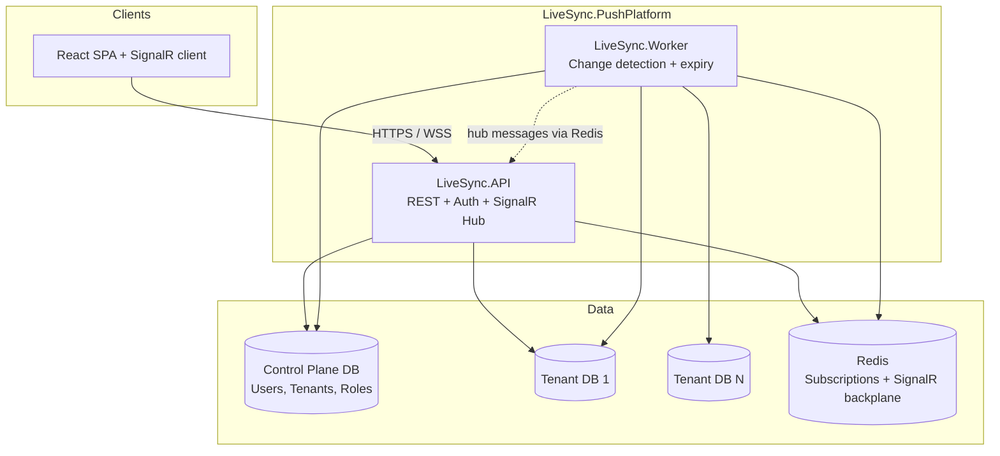
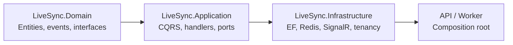
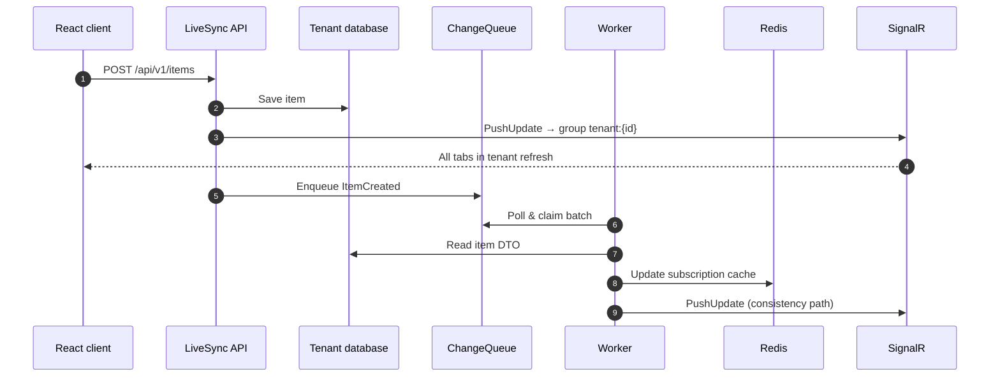
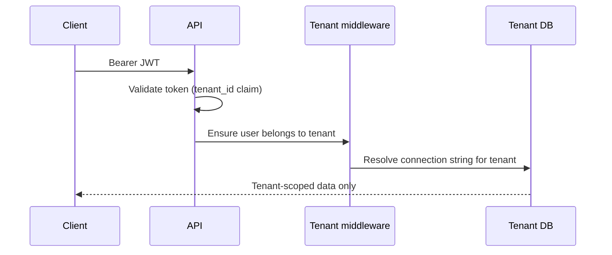

<p align="center">
  <strong>LiveSync</strong><br/>
  Multi-tenant SaaS platform with database-per-tenant isolation,<br/>
  CQRS, and real-time SignalR sync across users.
</p>

<p align="center">
  <a href="https://github.com/ismayilov449/LiveSync/actions/workflows/ci.yml"></a>
  
  
  
  
  
</p>

---

## Table of contents

- [At a glance](#at-a-glance)
- [Live demo](#live-demo)
- [Why this project exists](#why-this-project-exists)
- [Architecture](#architecture)
- [Real-time sync](#real-time-sync)
- [Multi-tenancy](#multi-tenancy)
- [Security & RBAC](#security--rbac)
- [Tech stack](#tech-stack)
- [Project structure](#project-structure)
- [Quick start](#quick-start)
- [Hands-on demo scenarios](#hands-on-demo-scenarios)
- [API reference](#api-reference)
- [Testing](#testing)
- [Docker](#docker)
- [Configuration](#configuration)
- [Design decisions](#design-decisions)
- [Documentation index](#documentation-index)
- [For reviewers & interviewers](#for-reviewers--interviewers)
- [License](#license)

---

## At a glance

| Question | Answer |
|----------|--------|
| **What is it?** | A portfolio-grade **multi-tenant SaaS backend** with a React SPA — not a tutorial todo app. |
| **What problem does it solve?** | Organizations need **isolated data** *and* **live UI updates** when any user in the org changes data. |
| **How is data isolated?** | **Database per tenant** + control plane for users/tenants. |
| **How is live sync done?** | Domain events → change queue → worker → Redis → **SignalR push** to all users in the tenant. |
| **What should I run first?** | [Quick start](#quick-start) → [Scenario: two users, one tenant](#scenario-two-users-one-tenant-live-sync) |

**30-second pitch:**  
*Register creates a new organization (tenant) with its own SQL database. Users in that org share items. When anyone creates or edits an item, every open browser tab in the same tenant refreshes automatically — no manual reload.*

---

## Live demo

### Architecture overview

<p align="center">
  
</p>

### Real-time sync — two users, same tenant

<p align="center">
  
</p>

> **Record your own GIF** (recommended for GitHub wow-factor): follow [docs/demo-walkthrough.md](docs/demo-walkthrough.md) Scenario 2, save as `docs/assets/demo-realtime-sync.gif`, then add:
>
> ``

---

## Why this project exists

Most CRUD demos stop at REST + React. LiveSync goes further to show patterns used in **production multi-tenant B2B SaaS**:

1. **Tenant isolation** — not just a `TenantId` column, but separate databases per customer.
2. **Clean architecture** — Domain, Application, Infrastructure, host projects.
3. **CQRS + domain events** — commands mutate state; events trigger side effects.
4. **Reliable real-time** — outbox-style change queue so pushes survive API/worker split.
5. **Operational basics** — Docker, CI, health checks, structured logging, integration tests.

If you're evaluating this repo for a role: start with the [demo walkthrough](docs/demo-walkthrough.md), then skim [architecture.md](docs/architecture.md).

---

## Architecture

### System context



### Component responsibilities

| Component | Responsibility | Does NOT |
|-----------|----------------|----------|
| **LiveSync.API** | REST `/api/v1/*`, JWT auth, React SPA, SignalR `/hubs/push`, immediate tenant push on mutations | Run change-detection loop (by default) |
| **LiveSync.Worker** | Poll `ChangeQueue` in each tenant DB, update Redis caches, tenant SignalR push, subscription TTL cleanup | Serve HTTP API to browsers |
| **Control plane DB** | `Tenants`, ASP.NET Identity users/roles | Store business items |
| **Tenant DBs** | `Items`, `ChangeQueue` (outbox) | Store users from other tenants |
| **Redis** | Subscription registry, topic cache, SignalR scale-out backplane | Primary persistence |

### Layering (Clean Architecture)



| Layer | Examples |
|-------|----------|
| **Domain** | `Item`, `ItemCreatedDomainEvent`, repository interfaces |
| **Application** | `CreateItemCommandHandler`, `SubscriptionManager`, `IRealTimeNotifier` |
| **Infrastructure** | `ItemRepository`, `RedisSubscriptionStore`, `SignalRRealTimeNotifier` |
| **API** | Controllers, middleware, JWT, SPA static files |
| **Worker** | Hosted services for change detection |

---

## Real-time sync

This is the **most interesting part** of the codebase.

### What happens when a user creates an item?



**Two push paths (intentional):**

| Path | Latency | Role |
|------|---------|------|
| **API immediate** | ~milliseconds | Users see changes instantly |
| **Worker queue** | ~1 second poll | Redis cache + subscription consistency |

Connections join SignalR group `tenant:{tenantId}` on hub connect — so **every user in the org** gets updates, not just the user who made the change.

Deep dive: [docs/real-time-sync.md](docs/real-time-sync.md)

---

## Multi-tenancy

### Model: database per tenant

```
LiveSync_ControlPlane          LiveSync_Tenant_1        LiveSync_Tenant_2
├── Tenants                    ├── Items                ├── Items
├── AspNetUsers (TenantId)     └── ChangeQueue          └── ChangeQueue
└── AspNetRoles
```

| Concept | Detail |
|---------|--------|
| **Register** | `POST /api/v1/auth/register` → **new tenant** + admin user + new database |
| **Invite** | `POST /api/v1/auth/users` → new user in **caller's tenant** (admin only) |
| **Item IDs** | Per-tenant — item `5` in tenant 1 ≠ item `5` in tenant 2 |
| **Root item** | Auto-created per tenant as hierarchy parent |

### Request pipeline



Details: [docs/tenancy.md](docs/tenancy.md) · ADR: [docs/adr/001-database-per-tenant.md](docs/adr/001-database-per-tenant.md)

---

## Security & RBAC

| Role | Items read/create/rename | Delete / move / deactivate | Invite users |
|------|------------------------|----------------------------|--------------|
| **TenantAdmin** | ✅ | ✅ | ✅ |
| **TenantUser** | ✅ | ❌ | ❌ |

- **Auth:** ASP.NET Identity + JWT (`tenant_id`, `user_id`, role claims)
- **API versioning:** `/api/v1/...` (+ legacy `/api/...` aliases)
- **Rate limiting:** auth endpoints
- **Errors:** RFC 7807 ProblemDetails
- **Dev only:** header auth fallback, `POST /api/v1/auth/dev/users` — disabled outside Development

---

## Tech stack

| Area | Technologies |
|------|----------------|
| **Runtime** | .NET 10, C# 13 |
| **API** | ASP.NET Core, EF Core 10, MediatR, FluentValidation |
| **Auth** | ASP.NET Identity, JWT Bearer |
| **Real-time** | SignalR, Redis backplane, StackExchange.Redis |
| **Frontend** | React 19, TypeScript, Vite, SignalR client |
| **Data** | SQL Server (control plane + per-tenant DBs) |
| **Testing** | xUnit, FluentAssertions, Moq, Testcontainers |
| **Ops** | Docker Compose, GitHub Actions, Serilog, OpenTelemetry |

---

## Project structure

```
LiveSync.PushPlatform/
├── LiveSync.Domain/              # Entities, domain events, value objects
├── LiveSync.Application/         # CQRS handlers, real-time sync, hub contracts
├── LiveSync.Infrastructure/      # EF Core, Redis, SignalR, tenancy, worker services
├── LiveSync.API/                 # REST API, auth middleware, React SPA (client/)
│   └── client/                   # Vite + React source (builds to wwwroot/)
├── LiveSync.Worker/              # Change detection + subscription expiry
├── LiveSync.Tests/               # Unit tests
├── LiveSync.IntegrationTests/    # Testcontainers + WebApplicationFactory
├── docs/                         # Architecture, walkthrough, ADRs, assets
├── docker-compose.yml            # SQL Server + Redis (+ full profile)
├── Dockerfile.api
└── Dockerfile.worker
```

---

## Quick start

### Prerequisites

- [.NET 10 SDK](https://dotnet.microsoft.com/download)
- [Node.js 20+](https://nodejs.org/)
- [Docker Desktop](https://www.docker.com/products/docker-desktop/) (SQL Server + Redis)

### 1. Clone & infrastructure

```bash
git clone https://github.com/ismayilov449/LiveSync.git
cd LiveSync/LiveSync.PushPlatform
docker compose up -d
```

### 2. Build frontend (required — `wwwroot/` is not committed)

```bash
cd LiveSync.API/client
npm install
npm run build
cd ../..
```

### 3. Run API

```bash
dotnet run --project LiveSync.API
```

| URL | Purpose |
|-----|---------|
| http://localhost:5252 | App + API |
| http://localhost:5252/scalar/v1 | OpenAPI (Development) |

### 4. Run Worker (recommended)

```bash
dotnet run --project LiveSync.Worker
```

### 5. Login (seeded dev user)

| Field | Value |
|-------|-------|
| Email | `admin@livesync.local` |
| Password | `Admin123!` |
| Tenant | `1` |

### Optional: Vite dev server

```bash
cd LiveSync.API/client && npm run dev
```

→ http://localhost:5173 (proxies API + SignalR to port 5252)

---

## Hands-on demo scenarios

Full scripted guide: **[docs/demo-walkthrough.md](docs/demo-walkthrough.md)**

### Scenario: Two users, one tenant (live sync)

1. Login as **admin** in a normal browser tab.
2. **Invite** a member user (Profile → Invite).
3. Open **incognito** → login as member.
4. Both tabs → **Items** → confirm **SignalR: Live**.
5. Create item in either tab → **both tabs update without refresh**.

This proves: shared tenant DB + tenant SignalR group + real-time list refresh.

### Scenario: Tenant isolation

1. **Register** a new organization (creates tenant 2).
2. Items from tenant 1 are invisible in tenant 2.

### Scenario: RBAC

- Member can create/rename items.
- Member cannot delete — buttons hidden; API returns 403.

---

## API reference

Base path: `/api/v1` (aliases: `/api/...`)

### Auth

| Method | Path | Auth | Description |
|--------|------|------|-------------|
| `POST` | `/auth/register` | Anonymous | New tenant + admin |
| `POST` | `/auth/login` | Anonymous | JWT token |
| `POST` | `/auth/users` | TenantAdmin | Invite user to tenant |
| `GET` | `/auth/me` | Bearer | Profile + roles |

### Items

| Method | Path | Auth | Description |
|--------|------|------|-------------|
| `GET` | `/items` | Bearer | Paginated list. Query: `page`, `pageSize`, `parentId` |
| `GET` | `/items/{id}` | Bearer | Single item |
| `POST` | `/items` | Bearer | Create item |
| `PUT` | `/items/{id}` | Bearer | Rename |
| `PUT` | `/items/{id}/parent` | TenantAdmin | Move |
| `POST` | `/items/{id}/deactivate` | TenantAdmin | Soft delete |
| `DELETE` | `/items/{id}` | TenantAdmin | Hard delete |

### Real-time & ops

| Path | Description |
|------|-------------|
| `/hubs/push?access_token={jwt}` | SignalR hub |
| `/health`, `/health/ready`, `/health/live` | Health probes |

---

## Testing

```bash
# Unit tests
dotnet test LiveSync.Tests

# Integration tests (Docker required for Testcontainers)
dotnet test LiveSync.IntegrationTests
```

**Integration coverage highlights:**

- Auth register/login
- Tenant isolation (items not visible across tenants)
- RBAC (member cannot delete; admin can)
- SignalR `PushUpdate` after item creation

CI runs on every push to `main` — see badge at top.

---

## Docker

**Infrastructure only** (SQL + Redis):

```bash
docker compose up -d
```

**Full stack** (API + Worker + SQL + Redis):

```bash
docker compose --profile full up --build
```

API: http://localhost:5252

---

## Configuration

| Key | Description |
|-----|-------------|
| `ConnectionStrings:ControlPlane` | Tenant registry + Identity |
| `ConnectionStrings:Redis` | Subscriptions + SignalR backplane |
| `Tenancy:ConnectionTemplate` | Per-tenant DB connection pattern |
| `Auth:Jwt:SecretKey` | JWT signing (use User Secrets in dev) |
| `Hosting:ApplyMigrationsOnStartup` | Auto-migrate on boot |

Never commit production secrets. See `appsettings.Development.json` for local patterns.

---

## Design decisions

| Topic | Decision | Doc |
|-------|----------|-----|
| Tenant isolation | Database per tenant | [ADR 001](docs/adr/001-database-per-tenant.md) |
| CQRS | MediatR commands/queries | [architecture.md](docs/architecture.md) |
| Real-time | Outbox queue + worker + SignalR groups | [real-time-sync.md](docs/real-time-sync.md) |
| API/worker split | API serves users; worker processes queue | [architecture.md](docs/architecture.md) |

---

## Documentation index

| Document | Contents |
|----------|----------|
| [docs/demo-walkthrough.md](docs/demo-walkthrough.md) | **Start here** — step-by-step demos |
| [docs/architecture.md](docs/architecture.md) | Components, flows, cross-cutting concerns |
| [docs/tenancy.md](docs/tenancy.md) | Multi-tenant model, register vs invite |
| [docs/real-time-sync.md](docs/real-time-sync.md) | Push pipeline, Redis, SignalR groups |
| [docs/adr/001-database-per-tenant.md](docs/adr/001-database-per-tenant.md) | Why separate DBs per tenant |
| [docs/assets/README.md](docs/assets/README.md) | GIF/screenshot recording guide |
| [CONTRIBUTING.md](CONTRIBUTING.md) | Dev setup, PR guidelines |

---

## For reviewers & interviewers

**Suggested 10-minute review path:**

1. Read [At a glance](#at-a-glance) (this file)
2. Run [Quick start](#quick-start)
3. Execute [two-user live sync scenario](#scenario-two-users-one-tenant-live-sync)
4. Skim `CreateItemCommandHandler` → `NotifyTenantItemDomainEventHandler` → `PushHub`
5. Glance at `LiveSync.IntegrationTests/` for proof it works

**Talking points:**

- *"Why database-per-tenant?"* → Strong isolation, per-tenant backup/restore, portfolio ADR.
- *"Why a worker if API already pushes?"* → Outbox pattern for reliable cache updates and filtered subscriptions at scale.
- *"How do you prevent cross-tenant leaks?"* → Separate DB + JWT tenant claim + middleware validation + EF filters.

**Clone checklist:**

```bash
docker compose up -d
cd LiveSync.API/client && npm ci && npm run build
dotnet run --project LiveSync.API
dotnet run --project LiveSync.Worker
```

---

## License

MIT — see [LICENSE](LICENSE).

---

<p align="center">
  <sub>Built as a portfolio project demonstrating production-style multi-tenant SaaS patterns.</sub>
</p>
