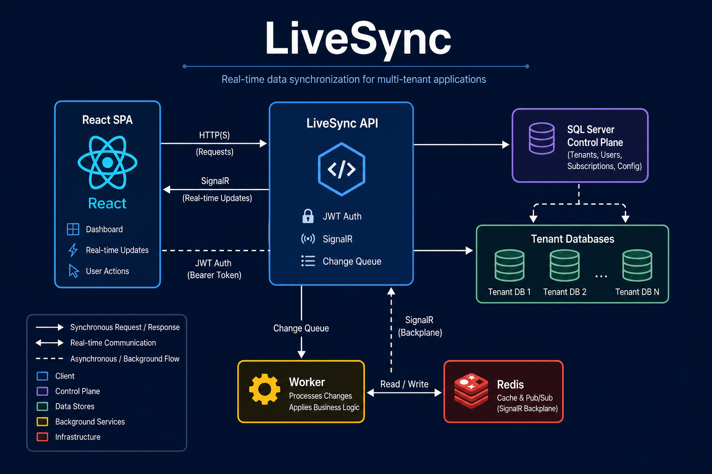
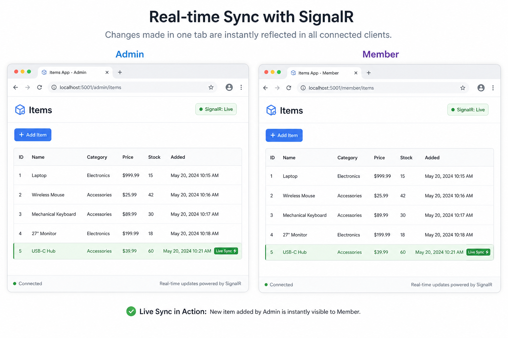
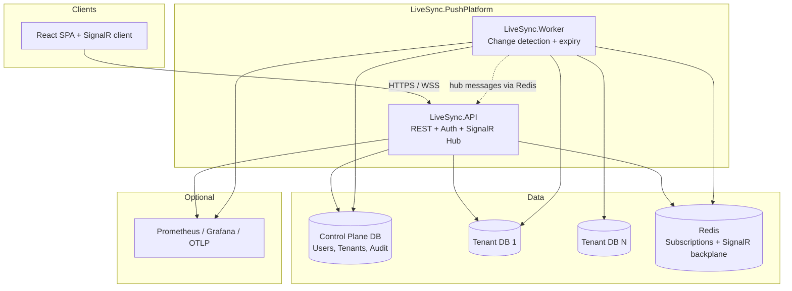
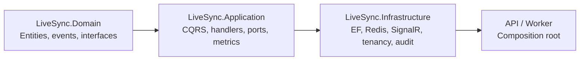
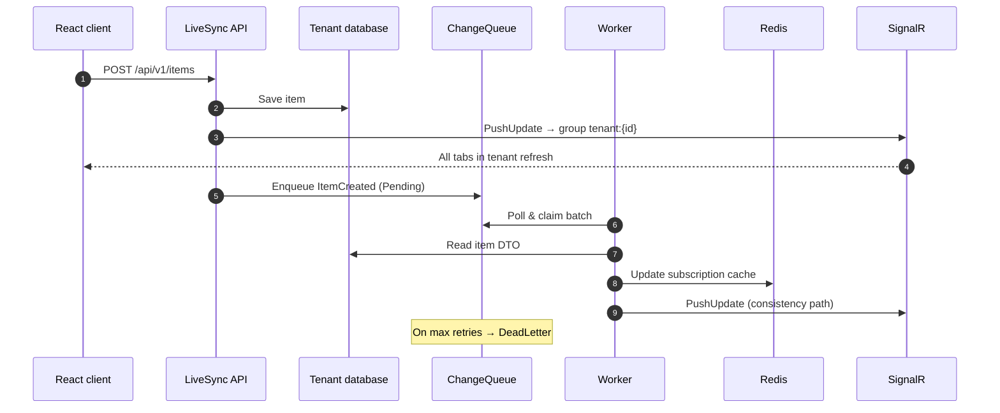
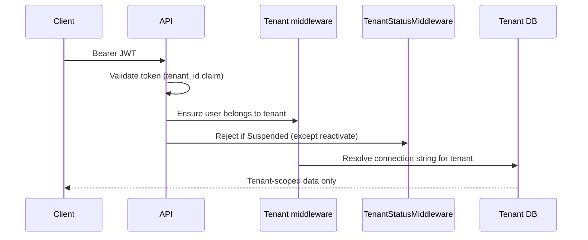

<p align="center">
  <strong>LiveSync</strong><br/>
  Multi-tenant SaaS platform with database-per-tenant isolation,<br/>
  CQRS, real-time SignalR sync, and tenant admin console.
</p>

<p align="center">
  <a href="https://github.com/ismayilov449/LiveSync/actions/workflows/ci.yml"></a>
  
  
  
  
  
  
</p>

---

## Table of contents

- [At a glance](#at-a-glance)
- [Live demo](#live-demo)
- [Why this project exists](#why-this-project-exists)
- [Architecture](#architecture)
- [Real-time sync](#real-time-sync)
- [Multi-tenancy](#multi-tenancy)
- [Admin UI](#admin-ui)
- [Security & RBAC](#security--rbac)
- [Observability](#observability)
- [Solution architecture](#solution-architecture)
- [Tech stack](#tech-stack)
- [Project structure](#project-structure)
- [Quick start](#quick-start)
- [Hands-on demo scenarios](#hands-on-demo-scenarios)
- [API reference](#api-reference)
- [Testing](#testing)
- [Docker](#docker)
- [Configuration](#configuration)
- [Design decisions](#design-decisions)
- [Documentation index](#documentation-index)
- [For reviewers & interviewers](#for-reviewers--interviewers)
- [License](#license)

---

## At a glance

| Question | Answer |
|----------|--------|
| **What is it?** | A portfolio-grade **multi-tenant SaaS backend** with a React SPA — not a tutorial todo app. |
| **What problem does it solve?** | Organizations need **isolated data** *and* **live UI updates** when any user in the org changes data. |
| **How is data isolated?** | **Database per tenant** + control plane for users/tenants/audit. |
| **How is live sync done?** | Domain events → change queue → worker → Redis → **SignalR push** to all users in the tenant. |
| **What else is included?** | Tenant admin console, audit log, suspend/reactivate, idempotency, per-tenant rate limits, Prometheus metrics. |
| **What should I run first?** | [Quick start](#quick-start) → [Scenario: two users, one tenant](#scenario-two-users-one-tenant-live-sync) |

**30-second pitch:**  
*Register creates a new organization (tenant) with its own SQL database. Users in that org share items. When anyone creates or edits an item, every open browser tab in the same tenant refreshes automatically. Tenant admins manage users, audit, queue health, and organization lifecycle from the Admin console.*

---

## Live demo

### Architecture overview

<p align="center">
  
</p>

### Real-time sync — two users, same tenant

<p align="center">
  
</p>

> **Record your own GIF** (recommended for GitHub wow-factor): follow [docs/demo-walkthrough.md](docs/demo-walkthrough.md) Scenario 2, save as `docs/assets/demo-realtime-sync.gif`, then add:
>
> ``

---

## Why this project exists

Most CRUD demos stop at REST + React. LiveSync goes further to show patterns used in **production multi-tenant B2B SaaS**:

1. **Tenant isolation** — not just a `TenantId` column, but separate databases per customer.
2. **Clean architecture** — Domain, Application, Infrastructure, host projects.
3. **CQRS + domain events** — commands mutate state; events trigger side effects.
4. **Reliable real-time** — outbox-style change queue with dead-letter handling.
5. **Operational maturity** — Prometheus metrics, OTLP, health checks, structured logging, integration tests.
6. **API platform basics** — rate limits, idempotency, audit log, tenant lifecycle.
7. **Tenant admin UX** — console for users, audit, queue stats, suspend/reactivate.

If you're evaluating this repo for a role: start with the [demo walkthrough](docs/demo-walkthrough.md), then skim [architecture.md](docs/architecture.md).

---

## Architecture

### System context



### Component responsibilities

| Component | Responsibility | Does NOT |
|-----------|----------------|----------|
| **LiveSync.API** | REST `/api/v1/*`, JWT auth, React SPA, SignalR `/hubs/push`, immediate tenant push, audit/lifecycle/ops APIs, `/metrics` | Run change-detection loop (by default) |
| **LiveSync.Worker** | Poll `ChangeQueue`, dead-letter after max retries, update Redis caches, tenant SignalR push, subscription TTL cleanup, `/metrics` on `:5260` | Serve HTTP API to browsers |
| **Control plane DB** | `Tenants`, ASP.NET Identity, `AuditEvents` | Store business items |
| **Tenant DBs** | `Items`, `ChangeQueue`, `IdempotencyRecords` | Store users from other tenants |
| **Redis** | Subscription registry, topic cache, SignalR scale-out backplane (Polly resilience) | Primary persistence |

### Layering (Clean Architecture)



| Layer | Examples |
|-------|----------|
| **Domain** | `Item`, `ItemCreatedDomainEvent`, repository interfaces |
| **Application** | `CreateItemCommandHandler`, `SubscriptionManager`, `IRealTimeNotifier`, `LiveSyncMetrics` |
| **Infrastructure** | `ItemRepository`, `RedisSubscriptionStore`, `AuditService`, `SqlIdempotencyStore` |
| **API** | Controllers, middleware, JWT, SPA static files |
| **Worker** | Hosted services for change detection and queue metrics |

---

## Real-time sync

This is the **most interesting part** of the codebase.

### What happens when a user creates an item?



**Two push paths (intentional):**

| Path | Latency | Role |
|------|---------|------|
| **API immediate** | ~milliseconds | Users see changes instantly |
| **Worker queue** | ~1 second poll | Redis cache + subscription consistency |

Connections join SignalR group `tenant:{tenantId}` on hub connect — so **every user in the org** gets updates, not just the user who made the change.

Deep dive: [docs/real-time-sync.md](docs/real-time-sync.md)

---

## Multi-tenancy

### Model: database per tenant

```
LiveSync_ControlPlane          LiveSync_Tenant_1        LiveSync_Tenant_2
├── Tenants                    ├── Items                ├── Items
├── AspNetUsers (TenantId)     ├── ChangeQueue          ├── ChangeQueue
├── AspNetRoles                └── IdempotencyRecords   └── IdempotencyRecords
└── AuditEvents
```

| Concept | Detail |
|---------|--------|
| **Register** | `POST /api/v1/auth/register` → **new tenant** + `TenantAdmin` + new database |
| **Invite** | `POST /api/v1/auth/users` → new user in **caller's tenant** (admin only) |
| **Suspend** | `POST /api/v1/tenants/suspend` → blocks API access (403); reactivate still allowed |
| **Item IDs** | Per-tenant — item `5` in tenant 1 ≠ item `5` in tenant 2 |
| **Root item** | Auto-created per tenant as hierarchy parent |

### Request pipeline



Details: [docs/tenancy.md](docs/tenancy.md) · ADR: [docs/adr/001-database-per-tenant.md](docs/adr/001-database-per-tenant.md)

---

## Admin UI

Tenant administrators (`TenantAdmin` role) see an **Admin** link in the header. The console uses a compact dark UI with monospace accents for technical data.

| Route | Purpose |
|-------|---------|
| `/admin/overview` | Organization name, status, change-queue pending / dead-letter counts |
| `/admin/users` | Invite users to the tenant |
| `/admin/audit` | Paginated audit log (create, update, delete, suspend, etc.) |
| `/admin/settings` | Suspend or reactivate the organization (with confirmation) |

**Account** (`/profile`) shows the signed-in user's profile, organization name, and tenant status — available to all authenticated users.

`GET /api/v1/auth/me` returns `tenantName` and `tenantStatus` for the sidebar and status chips.

---

## Security & RBAC

| Role | Items read/create/rename | Delete / move / deactivate | Invite users | Admin console |
|------|------------------------|----------------------------|--------------|---------------|
| **TenantAdmin** | ✅ | ✅ | ✅ | ✅ |
| **TenantUser** | ✅ | ❌ | ❌ | ❌ |

- **Auth:** ASP.NET Identity + JWT (`tenant_id`, `user_id`, role claims)
- **API versioning:** `/api/v1/...` (+ legacy `/api/...` aliases)
- **Rate limiting:** auth endpoints (30/min per IP); authenticated API (200/min per tenant, configurable)
- **Idempotency:** `Idempotency-Key` header on `POST /items`
- **Suspended tenants:** 403 on all routes except `POST /api/v1/tenants/reactivate`
- **Errors:** RFC 7807 ProblemDetails
- **Dev only:** header auth fallback, `POST /api/v1/auth/dev/users` — disabled outside Development

---

## Observability

### Metrics (built-in)

| Endpoint | Port | Content |
|----------|------|---------|
| API `/metrics` | 5252 | Prometheus scrape |
| Worker `/metrics` | 5260 | Prometheus scrape |

Custom metrics (Prometheus names use underscores):

| Metric | Description |
|--------|-------------|
| `livesync_change_queue_depth` | Pending outbox entries (all tenants) |
| `livesync_change_queue_dead_letter_depth` | Dead-letter entries |
| `livesync_changes_processed` | Successfully processed changes |
| `livesync_changes_failed` | Retriable failures |
| `livesync_changes_dead_lettered` | Moved to dead-letter |
| `livesync_signalr_pushes` | SignalR notifications sent |
| `livesync_changes_processing_duration_ms` | Processing time histogram |

### Optional local stack

```bash
cd observability
docker compose -f docker-compose.observability.yml --profile observability up -d
```

| Service | URL | Notes |
|---------|-----|-------|
| **Prometheus** | http://localhost:9090 | Query `livesync_change_queue_depth`; check **Status → Targets** |
| **Grafana** | http://localhost:3000 | Login `admin` / `admin`; add Prometheus datasource `http://prometheus:9090` |
| **OTLP collector** | `localhost:4317` (gRPC) | Set `Observability:Otlp:Endpoint` in `appsettings.json` |

> OTLP is **not** a browser URL — it receives traces/metrics from the API and Worker.

Admin **Overview** shows queue pending/dead-letter counts via `GET /api/v1/operations/change-queue`.

---

## Solution architecture

This repo is structured to demonstrate **solution architect** thinking — not only working code.

### Architecture deliverables

| Artifact | Purpose |
|----------|---------|
| [docs/solution-architecture.md](docs/solution-architecture.md) | **C4 diagrams**, NFRs, quality attributes, platform waves, risk register |
| [docs/adr/](docs/adr/) | Architecture Decision Records (why, not just what) |
| [docs/resume-bullets.md](docs/resume-bullets.md) | Copy-paste **CV / LinkedIn bullets** tied to this codebase |

### Highlight bullets (solution architect)

- **Multi-tenant isolation** — database-per-tenant with control plane; JWT tenant boundary; ADR-documented trade-offs
- **Split deployment** — stateless API + background Worker; independent scaling and failure domains
- **Reliable real-time** — transactional outbox + dead-letter + immediate API push + worker consistency path
- **Collaborative UX** — SignalR tenant groups over Redis backplane (scale-out ready)
- **Operability** — Prometheus metrics, OTLP hooks, health probes, structured logging, CI with integration tests
- **Governance** — versioned API, RBAC, per-tenant rate limits, audit log, idempotency, tenant lifecycle, admin console

Full C4 + NFRs: **[docs/solution-architecture.md](docs/solution-architecture.md)**

---

## Tech stack

| Area | Technologies |
|------|----------------|
| **Runtime** | .NET 10, C# 13 |
| **API** | ASP.NET Core, EF Core 10, MediatR, FluentValidation |
| **Auth** | ASP.NET Identity, JWT Bearer |
| **Real-time** | SignalR, Redis backplane, StackExchange.Redis, Polly |
| **Frontend** | React 19, TypeScript, Vite, SignalR client, JetBrains Mono |
| **Data** | SQL Server (control plane + per-tenant DBs) |
| **Testing** | xUnit, FluentAssertions, Moq, Testcontainers |
| **Ops** | Docker Compose, GitHub Actions, Serilog, OpenTelemetry, Prometheus |

---

## Project structure

```
LiveSync.PushPlatform/
├── LiveSync.Domain/              # Entities, domain events, value objects
├── LiveSync.Application/         # CQRS handlers, real-time sync, metrics, ports
├── LiveSync.Infrastructure/      # EF Core, Redis, SignalR, tenancy, audit, worker services
├── LiveSync.API/                 # REST API, auth middleware, React SPA (client/)
│   └── client/                   # Vite + React source (builds to wwwroot/)
├── LiveSync.Worker/              # Change detection, dead-letter, subscription expiry
├── LiveSync.Tests/               # Unit tests (8)
├── LiveSync.IntegrationTests/    # Testcontainers + WebApplicationFactory (11)
├── docs/                         # Architecture, walkthrough, ADRs, assets
├── observability/                # Prometheus, Grafana, OTLP collector compose
├── docker-compose.yml            # SQL Server + Redis (+ full profile)
├── Dockerfile.api
└── Dockerfile.worker
```

---

## Quick start

### Prerequisites

- [.NET 10 SDK](https://dotnet.microsoft.com/download)
- [Node.js 20+](https://nodejs.org/)
- [Docker Desktop](https://www.docker.com/products/docker-desktop/) (SQL Server + Redis)

### 1. Clone & infrastructure

```bash
git clone https://github.com/ismayilov449/LiveSync.git
cd LiveSync/LiveSync.PushPlatform
docker compose up -d
```

### 2. Build frontend (required — `wwwroot/` is not committed)

```bash
cd LiveSync.API/client
npm install
npm run build
cd ../..
```

### 3. Run API

```bash
dotnet run --project LiveSync.API
```

| URL | Purpose |
|-----|---------|
| http://localhost:5252 | App + API |
| http://localhost:5252/scalar/v1 | OpenAPI (Development) |
| http://localhost:5252/metrics | Prometheus metrics |

### 4. Run Worker (recommended)

```bash
dotnet run --project LiveSync.Worker
```

Worker metrics: http://localhost:5260/metrics

### 5. Login (seeded dev user)

| Field | Value |
|-------|-------|
| Email | `admin@livesync.local` |
| Password | `Admin123!` |
| Tenant | `1` |

### Optional: Vite dev server

```bash
cd LiveSync.API/client && npm run dev
```

→ http://localhost:5173 (proxies API + SignalR to port 5252)

### Optional: Observability stack

```bash
cd observability
docker compose -f docker-compose.observability.yml --profile observability up -d
```

---

## Hands-on demo scenarios

Full scripted guide: **[docs/demo-walkthrough.md](docs/demo-walkthrough.md)**

### Scenario: Two users, one tenant (live sync)

1. Login as **admin** in a normal browser tab.
2. **Admin → Users** — invite a member user.
3. Open **incognito** → login as member.
4. Both tabs → **Items** → confirm **signalr · live** (green dot).
5. Create item in either tab → **both tabs update without refresh**.

This proves: shared tenant DB + tenant SignalR group + real-time list refresh.

### Scenario: Tenant isolation

1. **Register** a new organization (creates tenant 2).
2. Items from tenant 1 are invisible in tenant 2.

### Scenario: RBAC

- Member can create/rename items.
- Member cannot delete — buttons hidden; API returns 403.
- Member does not see **Admin** nav.

### Scenario: Tenant admin

1. **Admin → Overview** — queue pending / dead-letter (with Worker running).
2. **Admin → Audit** — see item create/update entries.
3. **Admin → Settings** — suspend tenant, then reactivate.

---

## API reference

Base path: `/api/v1` (aliases: `/api/...`)

### Auth

| Method | Path | Auth | Description |
|--------|------|------|-------------|
| `POST` | `/auth/register` | Anonymous | New tenant + admin |
| `POST` | `/auth/login` | Anonymous | JWT token |
| `POST` | `/auth/users` | TenantAdmin | Invite user to tenant |
| `GET` | `/auth/me` | Bearer | Profile, roles, `tenantName`, `tenantStatus` |
| `POST` | `/auth/dev/users` | Anonymous | Dev only — create user for any tenant |

### Items

| Method | Path | Auth | Description |
|--------|------|------|-------------|
| `GET` | `/items` | Bearer | Paginated list. Query: `page`, `pageSize`, `parentId` |
| `GET` | `/items/{id}` | Bearer | Single item |
| `POST` | `/items` | Bearer | Create item. Optional header: `Idempotency-Key` |
| `PUT` | `/items/{id}` | Bearer | Rename |
| `PUT` | `/items/{id}/parent` | TenantAdmin | Move |
| `POST` | `/items/{id}/deactivate` | TenantAdmin | Soft delete |
| `DELETE` | `/items/{id}` | TenantAdmin | Hard delete |

### Tenants (lifecycle)

| Method | Path | Auth | Description |
|--------|------|------|-------------|
| `POST` | `/tenants/suspend` | TenantAdmin | Suspend organization (403 thereafter) |
| `POST` | `/tenants/reactivate` | TenantAdmin | Restore access |

### Operations & audit

| Method | Path | Auth | Description |
|--------|------|------|-------------|
| `GET` | `/operations/change-queue` | TenantAdmin | Pending + dead-letter counts for tenant |
| `GET` | `/audit` | TenantAdmin | Paginated audit log. Query: `page`, `pageSize` |

### Real-time & ops

| Path | Description |
|------|-------------|
| `/hubs/push?access_token={jwt}` | SignalR hub |
| `/health`, `/health/ready`, `/health/live` | Health probes |
| `/metrics` | Prometheus metrics (API and Worker) |

---

## Testing

```bash
# Unit tests (8)
dotnet test LiveSync.Tests

# Integration tests (11 — Docker required for Testcontainers)
dotnet test LiveSync.IntegrationTests
```

**Integration coverage highlights:**

- Auth register/login
- Tenant isolation (items not visible across tenants)
- RBAC (member cannot delete or invite; admin can)
- SignalR `PushUpdate` after item creation
- Tenant suspend/reactivate (403 while suspended)
- Idempotency key replay returns same item id
- Audit log entry on item create
- `/metrics` endpoint available

CI runs on every push to `main` — see badge at top.

---

## Docker

**Infrastructure only** (SQL + Redis):

```bash
docker compose up -d
```

**Full stack** (API + Worker + SQL + Redis):

```bash
docker compose --profile full up --build
```

**Observability** (Prometheus + Grafana + OTLP collector):

```bash
cd observability
docker compose -f docker-compose.observability.yml --profile observability up -d
```

API: http://localhost:5252

---

## Configuration

| Key | Description |
|-----|-------------|
| `ConnectionStrings:ControlPlane` | Tenant registry + Identity + audit |
| `ConnectionStrings:Redis` | Subscriptions + SignalR backplane |
| `Tenancy:ConnectionTemplate` | Per-tenant DB connection pattern |
| `Auth:Jwt:SecretKey` | JWT signing (use User Secrets in dev) |
| `Hosting:ApplyMigrationsOnStartup` | Auto-migrate on boot |
| `ChangeDetection:MaxRetries` | Retries before dead-letter (default 5) |
| `Observability:EnablePrometheus` | Expose `/metrics` (default true) |
| `Observability:Otlp:Endpoint` | OTLP gRPC endpoint (e.g. `http://localhost:4317`) |
| `RateLimiting:TenantPermitLimit` | API requests per tenant per window (default 200) |
| `RateLimiting:TenantWindowSeconds` | Rate limit window (default 60) |

Never commit production secrets. See `appsettings.Development.json` for local patterns.

---

## Design decisions

| Topic | Decision | Doc |
|-------|----------|-----|
| Tenant isolation | Database per tenant | [ADR 001](docs/adr/001-database-per-tenant.md) |
| Process split | API + Worker | [ADR 002](docs/adr/002-api-worker-split.md) |
| Reliable sync | SQL change queue (outbox) + dead-letter | [ADR 003](docs/adr/003-change-queue-outbox.md) |
| Live broadcast | SignalR tenant groups | [ADR 004](docs/adr/004-signalr-tenant-groups.md) |
| Full architecture view | C4, NFRs, platform waves | [solution-architecture.md](docs/solution-architecture.md) |
| CQRS | MediatR commands/queries | [architecture.md](docs/architecture.md) |
| Real-time | Outbox + worker + SignalR | [real-time-sync.md](docs/real-time-sync.md) |
| Tenancy lifecycle | Suspend/reactivate + middleware | [tenancy.md](docs/tenancy.md) |

---

## Documentation index

| Document | Contents |
|----------|----------|
| [docs/solution-architecture.md](docs/solution-architecture.md) | **Solution architect view** — C4, NFRs, platform waves, risks |
| [docs/resume-bullets.md](docs/resume-bullets.md) | CV / LinkedIn copy-paste bullets |
| [docs/demo-walkthrough.md](docs/demo-walkthrough.md) | **Start here** — step-by-step demos (7 scenarios) |
| [docs/architecture.md](docs/architecture.md) | Components, middleware, SPA routes, cross-cutting |
| [docs/tenancy.md](docs/tenancy.md) | Multi-tenant model, lifecycle, register vs invite |
| [docs/real-time-sync.md](docs/real-time-sync.md) | Push pipeline, dead-letter, metrics |
| [docs/adr/001-database-per-tenant.md](docs/adr/001-database-per-tenant.md) | Why separate DBs per tenant |
| [docs/adr/](docs/adr/) | All ADRs (002–004: worker split, outbox, SignalR groups) |
| [docs/assets/README.md](docs/assets/README.md) | GIF/screenshot recording guide |
| [CONTRIBUTING.md](CONTRIBUTING.md) | Dev setup, PR guidelines, doc map |

---

## For reviewers & interviewers

**Suggested 10-minute review path:**

1. [docs/solution-architecture.md](docs/solution-architecture.md) — C4 + NFRs + platform waves
2. [docs/demo-walkthrough.md](docs/demo-walkthrough.md) — live demo (two users, one tenant)
3. Skim `CreateItemCommandHandler` → `NotifyTenantItemDomainEventHandler` → `PushHub`
4. Review [ADRs](docs/adr/) for decision rationale
5. Glance at `LiveSync.IntegrationTests/` (11 tests) for proof it works
6. Optional: **Admin → Overview** + http://localhost:5252/metrics

**Talking points:**

- *"Why database-per-tenant?"* → Strong isolation, per-tenant backup/restore, portfolio ADR.
- *"Why a worker if API already pushes?"* → Outbox pattern for reliable cache updates, dead-letter visibility, and filtered subscriptions at scale.
- *"How do you prevent cross-tenant leaks?"* → Separate DB + JWT tenant claim + middleware validation + EF filters.
- *"How do you operate this?"* → Prometheus queue metrics, health probes, suspend/reactivate lifecycle, audit log.

**Clone checklist:**

```bash
docker compose up -d
cd LiveSync.API/client && npm ci && npm run build
dotnet run --project LiveSync.API
dotnet run --project LiveSync.Worker
```

---

## License

MIT — see [LICENSE](LICENSE).

---

<p align="center">
  <sub>Built as a portfolio project demonstrating production-style multi-tenant SaaS patterns.</sub>
</p>
