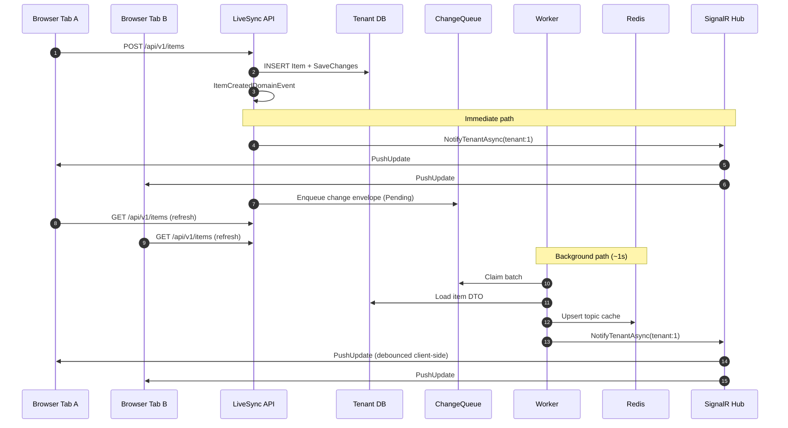

# Real-time sync pipeline

How LiveSync keeps multiple browser tabs (and users) in sync within the same tenant.

## Two notification paths (by design)

| Path | When | Purpose |
|------|------|---------|
| **API immediate push** | Right after item save in API | Fast UI refresh for all users in tenant |
| **Worker queue processing** | Polls `ChangeQueue` every ~1s | Redis topic cache, filtered subscriptions, consistency |

Both send `PushUpdate` to SignalR group `tenant:{tenantId}`.

## Change queue states

| Status | Meaning |
|--------|---------|
| `Pending` | Awaiting worker processing |
| `DeadLetter` | Failed after `ChangeDetection:MaxRetries` (default 5) |

Dead-letter entries remain in the tenant DB for inspection. Admins can view aggregate counts via `GET /api/v1/operations/change-queue` and the **Admin → Overview** page.

Prometheus gauges (sampled every 15s by `ChangeQueueMetricsHostedService`):

- `livesync_change_queue_depth`
- `livesync_change_queue_dead_letter_depth`

## Sequence — create item

## Client behavior

1. On Items page load → connect to `/hubs/push?access_token=...`
2. Hub adds connection to group `tenant:{tenantId}`
3. `FindAndSubscribe` registers Redis subscription (for filtered cache snapshots)
4. On `PushUpdate` → debounced refresh of page 1 (newest items first)
5. Stale HTTP responses are ignored if a newer refresh is in flight
6. Header shows **signalr · live** status pill (green dot when connected)

## SignalR groups vs connection IDs

Early versions targeted individual `connectionId` values stored in Redis. Reconnects (background tabs, network blips) could leave stale IDs. **Tenant groups** ensure every live connection for a tenant receives pushes regardless of subscription record state.

## Redis responsibilities

| Key pattern | Role |
|-------------|------|
| `{tenantId}:livesync:subs:*` | Subscription registry |
| `{tenantId}:livesync:topics:bucket:*` | Active filter topics |
| Topic hash keys | Cached DTO snapshots per filter |
| SignalR backplane | Cross-process hub messaging (API ↔ Worker) |

Redis calls use **Polly** retry and circuit breaker (`RedisResilienceExecutor`).

Shared channel prefix: `LiveSync` (see `LiveSyncSignalR.RedisChannelPrefix`).

## Observability

| Metric | Type | Description |
|--------|------|-------------|
| `livesync.changes.processed` | Counter | Successful queue processing |
| `livesync.changes.failed` | Counter | Retriable failures |
| `livesync.changes.dead_lettered` | Counter | Moved to dead-letter |
| `livesync.changes.processing_duration_ms` | Histogram | Per-entry processing time |
| `livesync.signalr.pushes` | Counter | Push notifications sent |
| `livesync.change_queue.depth` | Gauge | Pending entries (all tenants) |
| `livesync.change_queue.dead_letter_depth` | Gauge | Dead-letter entries |

Scrape `/metrics` on API (`:5252`) and Worker (`:5260`). See README for Prometheus/Grafana setup.

## Failure modes

| Symptom | Likely cause |
|---------|----------------|
| Creator sees item, others don't | SignalR offline; check status pill |
| One user always behind | Fixed: stale fetch race + worker-only push |
| Nothing live at all | Redis down; Worker not running |
| Only works for one user | Tab not in tenant group; re-login |
| Queue depth growing | Worker stopped or processing errors; check dead-letter count |
| Dead-letter count rising | Downstream Redis/DB errors; inspect worker logs |

See [demo-walkthrough.md](demo-walkthrough.md) for hands-on verification.
