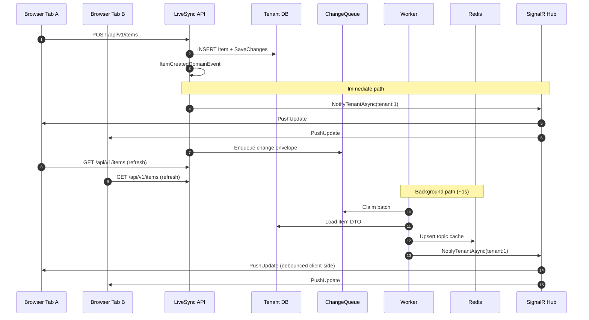

# Real-time sync pipeline

How LiveSync keeps multiple browser tabs (and users) in sync within the same tenant.

## Two notification paths (by design)

| Path | When | Purpose |
|------|------|---------|
| **API immediate push** | Right after item save in API | Fast UI refresh for all users in tenant |
| **Worker queue processing** | Polls `ChangeQueue` every ~1s | Redis topic cache, filtered subscriptions, consistency |

Both send `PushUpdate` to SignalR group `tenant:{tenantId}`.

## Sequence — create item

## Client behavior

1. On Items page load → connect to `/hubs/push?access_token=...`
2. Hub adds connection to group `tenant:{tenantId}`
3. `FindAndSubscribe` registers Redis subscription (for filtered cache snapshots)
4. On `PushUpdate` → debounced refresh of page 1 (newest items first)
5. Stale HTTP responses are ignored if a newer refresh is in flight

## SignalR groups vs connection IDs

Early versions targeted individual `connectionId` values stored in Redis. Reconnects (background tabs, network blips) could leave stale IDs. **Tenant groups** ensure every live connection for a tenant receives pushes regardless of subscription record state.

## Redis responsibilities

| Key pattern | Role |
|-------------|------|
| `{tenantId}:livesync:subs:*` | Subscription registry |
| `{tenantId}:livesync:topics:bucket:*` | Active filter topics |
| Topic hash keys | Cached DTO snapshots per filter |
| SignalR backplane | Cross-process hub messaging (API ↔ Worker) |

Shared channel prefix: `LiveSync` (see `LiveSyncSignalR.RedisChannelPrefix`).

## Failure modes

| Symptom | Likely cause |
|---------|----------------|
| Creator sees item, others don't | SignalR offline; check badge |
| One user always behind | Fixed: stale fetch race + worker-only push |
| Nothing live at all | Redis down; Worker not running |
| Only works for one user | Tab not in tenant group; re-login |

See [demo-walkthrough.md](demo-walkthrough.md) for hands-on verification.
