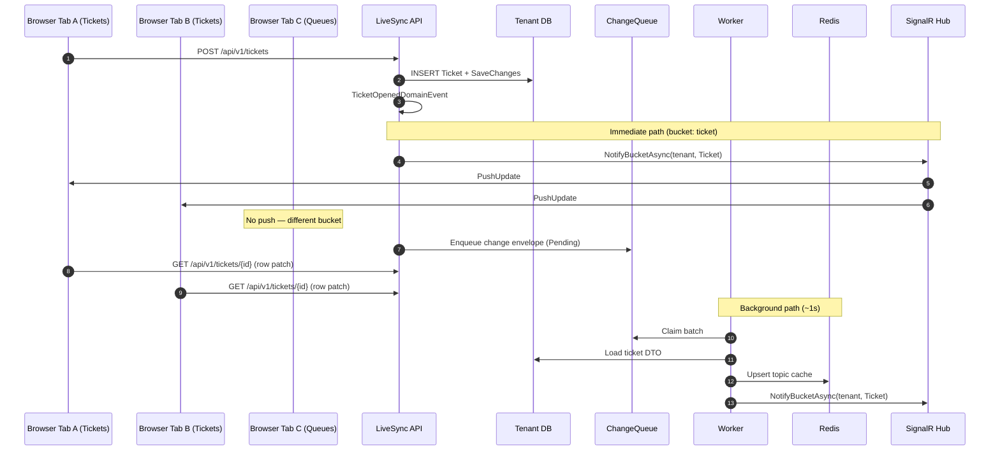

# Real-time sync pipeline

How LiveSync keeps multiple browser tabs (and users) in sync within the same tenant — **per data bucket** (Tickets vs Queues).

## Two notification paths (by design)

| Path | When | Purpose |
|------|------|---------|
| **API immediate push** | Right after save in API | Fast UI update for subscribers of that bucket |
| **Worker queue processing** | Polls `ChangeQueue` every ~1s | Redis topic cache, filtered subscriptions, consistency |

Both send `PushUpdate` to SignalR group `tenant:{tenantId}:bucket:{ticket|queue}`.

## Change queue states

| Status | Meaning |
|--------|---------|
| `Pending` | Awaiting worker processing |
| `DeadLetter` | Failed after `ChangeDetection:MaxRetries` (default 5) |

Dead-letter entries remain in the tenant DB for inspection. Admins can view aggregate counts via `GET /api/v1/operations/change-queue` and the **Admin → Overview** page.

Prometheus gauges (sampled every 15s by `ChangeQueueMetricsHostedService`):

- `livesync_change_queue_depth`
- `livesync_change_queue_dead_letter_depth`

## Sequence — open ticket (bucket: ticket)

Queues follow the same pattern with `TopicBucket.Queue` and `/api/v1/queues`.

**Ticket workflow events** (assign, comment, status change) also enqueue and push on the `ticket` bucket.

## Client behavior

1. On Tickets or Queues page load → connect to `/hubs/push?access_token=...`
2. `FindAndSubscribe` with bucket + tenant filter; connection joins `tenant:{id}:bucket:{ticket|queue}`
3. On `PushUpdate` for matching bucket:
   - **Delete** — remove row from table state
   - **Upsert** — `GET` single entity, patch row in place (no full list refetch)
4. New rows on page 1 insert sorted newest-first; remote changes show red **flash icon** (other sessions only)
5. Selected ticket detail panel refreshes when push targets the open ticket id
6. Header shows **signalr · live** status pill (green dot when connected)

Details: [client-development.md](client-development.md)

## SignalR groups vs connection IDs

Early versions targeted individual `connectionId` values stored in Redis. Reconnects could leave stale IDs. **Bucket-scoped tenant groups** ensure every live connection subscribed to that bucket receives pushes. ADR [004](adr/004-signalr-tenant-groups.md) (amended by [005](adr/005-multi-bucket-real-time-sync.md)).

## Redis responsibilities

| Key pattern | Role |
|-------------|------|
| `{tenantId}:livesync:subs:*` | Subscription registry |
| `{tenantId}:livesync:topics:bucket:*` | Active filter topics per bucket |
| Topic hash keys | Cached DTO snapshots per filter |
| SignalR backplane | Cross-process hub messaging (API ↔ Worker) |

Redis calls use **Polly** retry and circuit breaker (`RedisResilienceExecutor`).

Shared channel prefix: `LiveSync` (see `LiveSyncSignalR.RedisChannelPrefix`).

## Observability

| Metric | Type | Description |
|--------|------|-------------|
| `livesync_changes_processed` | Counter | Successful queue processing |
| `livesync_changes_failed` | Counter | Retriable failures |
| `livesync_changes_dead_lettered` | Counter | Moved to dead-letter |
| `livesync_changes_processing_duration_ms` | Histogram | Per-entry processing time |
| `livesync_signalr_pushes` | Counter | Push notifications sent |
| `livesync_change_queue_depth` | Gauge | Pending entries (all tenants) |
| `livesync_change_queue_dead_letter_depth` | Gauge | Dead-letter entries |

Scrape `/metrics` on API (`:5252`) and Worker (`:5260`). See README for Prometheus/Grafana setup.

## Failure modes

| Symptom | Likely cause |
|---------|----------------|
| Creator sees ticket, others don't | SignalR offline; check status pill |
| Queues tab updates on Ticket change | Old client build; bucket filter missing |
| One user always behind | Worker not running; check queue depth |
| Nothing live at all | Redis down; Worker not running |
| Queue depth growing | Worker stopped or processing errors; check dead-letter count |
| Dead-letter count rising | Downstream Redis/DB errors; inspect worker logs |
| Detail panel stale after push | Selected ticket id mismatch; check `handlePushUpdate` |

See [troubleshooting.md](troubleshooting.md) and [demo-walkthrough.md](demo-walkthrough.md).
