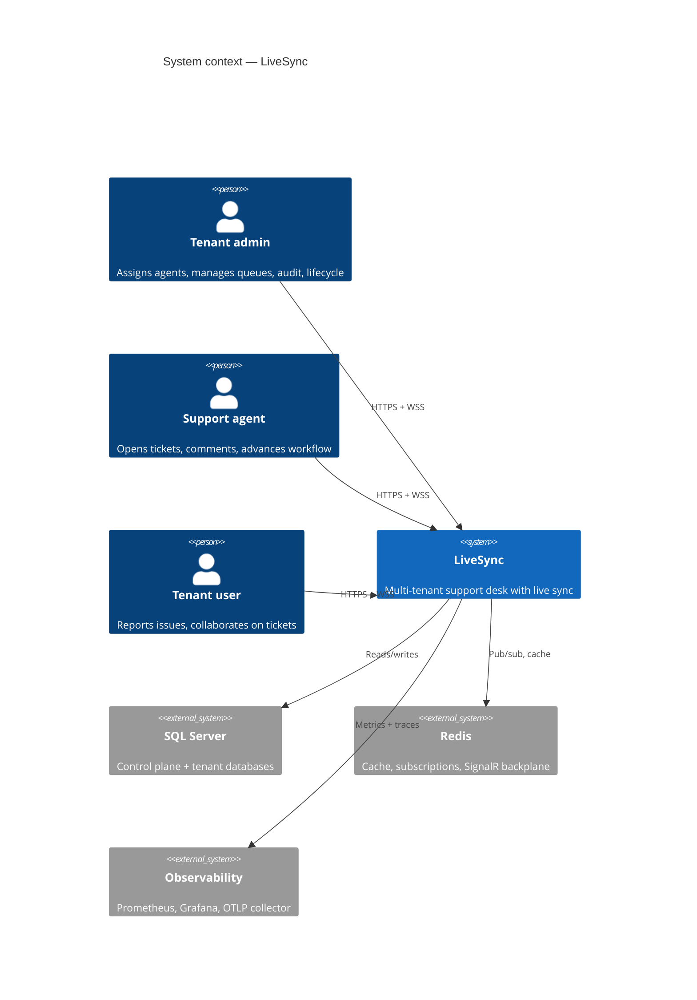
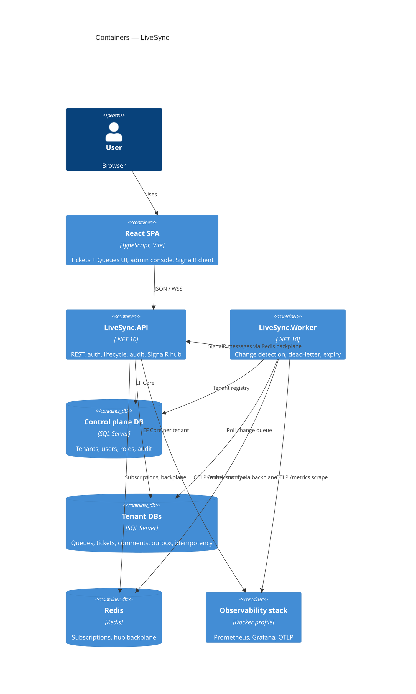
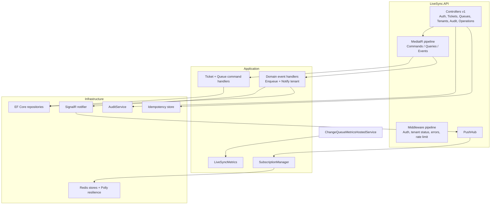
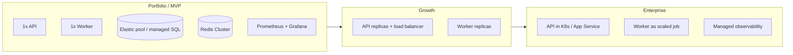

# Solution architecture — LiveSync

This document is written for **technical leads, solution architects, and interviewers** who want the "why" behind the system — not only the "how" in code.

---

## Executive summary

LiveSync is a **multi-tenant B2B support desk SaaS reference architecture** that separates:

| Concern | Approach |
|---------|----------|
| **Tenant isolation** | Database per tenant + control plane |
| **Business domain** | Support Desk — Queues + Tickets (DDD aggregates) |
| **Write model** | CQRS + domain events + status machine invariants |
| **Real-time UX** | Bucket-scoped SignalR groups + outbox change queue |
| **Scale path** | Stateless API, horizontal worker pool, Redis backplane |
| **Operations** | Health probes, Prometheus metrics, OTLP, structured logs, CI |
| **API platform** | Per-tenant rate limits, idempotency, audit log, tenant lifecycle |
| **Admin UX** | Tenant-scoped admin console (users, audit, settings, queue overview) |

**Visual demos** (recorded from the running app): see [README Live demo](../README.md#live-demo) and [docs/assets/](assets/).

---

## C4 model

### Level 1 — System context

Who uses the system and what it integrates with.



### Level 2 — Containers

Deployable units and how they communicate.



### Level 3 — Application components (API)



---

## Quality attributes (architecture goals)

| Attribute | Target | How LiveSync addresses it |
|-----------|--------|---------------------------|
| **Isolation** | No cross-tenant data leaks | Separate DB per tenant; JWT `tenant_id`; middleware validation |
| **Consistency** | Users see fresh data | API immediate push + worker outbox for cache alignment |
| **Domain integrity** | Valid ticket lifecycle | Status transitions in `Ticket` aggregate; queue deactivate rules |
| **Availability** | Survive single process failure | API and Worker separable; Redis backplane; health endpoints |
| **Scalability** | More tenants / concurrent users | Stateless API replicas; worker pool; DB-per-tenant horizontal data partition |
| **Security** | Least privilege | RBAC; JWT; rate-limited auth; per-tenant API limits; ProblemDetails errors |
| **Maintainability** | Clear boundaries | Clean architecture layers; ADRs; integration tests |
| **Observability** | Debug production issues | Serilog + correlation ID; Prometheus custom metrics; OTLP export |
| **Governance** | Audit and lifecycle | Audit log; suspend/reactivate; idempotent ticket open |

---

## Non-functional requirements (NFRs)

### Performance

| NFR | Specification |
|-----|----------------|
| API ticket open | Synchronous response &lt; 500 ms (local dev baseline) |
| Live update latency | API push path: sub-second to other tabs in tenant |
| Worker poll interval | Configurable (`ChangeDetection:PollIntervalMs`, default 1000 ms) |

### Security

| NFR | Specification |
|-----|----------------|
| Authentication | JWT bearer; optional API key middleware |
| Authorization | Role-based (`TenantAdmin`, `TenantUser`) |
| Tenant boundary | User must belong to tenant in JWT; separate databases |
| Suspended tenants | 403 on all routes except `POST /tenants/reactivate` |
| Rate limits | Auth: 30/min per IP; API: 200/min per tenant (configurable) |
| Secrets | Not committed; User Secrets / env vars in deployment |

### Reliability

| NFR | Specification |
|-----|----------------|
| Change delivery | Outbox table in tenant DB; worker retries with max retry count |
| Dead letter | Entries marked `DeadLetter` after `MaxRetries` (default 5) |
| Stale subscriptions | TTL + renewal from client; expiry hosted service |
| Idempotency | `Idempotency-Key` on ticket open prevents duplicate resources |
| SQL transient errors | EF `EnableRetryOnFailure` (3 retries) |
| Redis transient errors | Polly retry + circuit breaker on Redis operations |

### Operability

| NFR | Specification |
|-----|----------------|
| Health | `/health`, `/health/ready`, `/health/live` (API + Worker) |
| Metrics | Prometheus `/metrics` on API (`:5252`) and Worker (`:5260`) |
| Queue visibility | `GET /operations/change-queue`; gauges `livesync_change_queue_*` |
| Logging | Serilog structured logs with correlation ID |
| Tracing | OpenTelemetry → OTLP when `Observability:Otlp:Endpoint` is set |
| CI | Build, test, Docker image build on every PR |

---

## Platform capabilities (implemented)

Grouped by delivery wave — all present in the current codebase:

### Wave 1 — Operability

| Capability | Detail |
|------------|--------|
| Prometheus metrics | `/metrics` on API and Worker |
| Custom metrics | Queue depth, dead-letter depth, change counters, SignalR pushes, processing duration |
| OTLP export | `Observability:Otlp:Endpoint` in configuration |
| Queue sampling | `ChangeQueueMetricsHostedService` (15s interval) |
| Local observability stack | `observability/docker-compose.observability.yml` (Prometheus, Grafana, collector) |

### Wave 2 — Reliability & lifecycle

| Capability | Detail |
|------------|--------|
| Tenant suspend / reactivate | `POST /api/v1/tenants/suspend`, `/reactivate` |
| Suspended tenant guard | `TenantStatusMiddleware` → 403 |
| Dead-letter queue | `ChangeQueueStatus.DeadLetter` after max retries |
| Operations API | `GET /api/v1/operations/change-queue` (admin) |
| Redis resilience | Polly retry/circuit breaker |
| SQL resilience | EF `EnableRetryOnFailure` on tenant connections |

### Wave 3 — API platform

| Capability | Detail |
|------------|--------|
| Per-tenant rate limiting | `RateLimiting:TenantPermitLimit` / `TenantWindowSeconds` |
| Idempotency | `Idempotency-Key` header on `POST /tickets` |
| Audit log | `AuditEvents` table; `GET /api/v1/audit` |
| Admin SPA | `/admin/*` routes for overview, users, audit, settings |
| Tenant user list | `GET /api/v1/auth/users` for assignee picker |

### Wave 4 — Support Desk domain

| Capability | Detail |
|------------|--------|
| Queue aggregate | Work streams; deactivate blocked when open tickets exist |
| Ticket aggregate | Status machine; comments as child entities |
| Workflow API | assign, start-progress, resolve, close |
| Client UX | Ticket detail panel, assign dropdown, workflow hints, remote push flash |

---

## Key architectural decisions

| ID | Decision | Document |
|----|----------|----------|
| ADR-001 | Database per tenant | [adr/001-database-per-tenant.md](adr/001-database-per-tenant.md) |
| ADR-002 | API + Worker process split | [adr/002-api-worker-split.md](adr/002-api-worker-split.md) |
| ADR-003 | SQL change queue (outbox) | [adr/003-change-queue-outbox.md](adr/003-change-queue-outbox.md) |
| ADR-004 | SignalR tenant groups | [adr/004-signalr-tenant-groups.md](adr/004-signalr-tenant-groups.md) |
| ADR-005 | Multi-bucket real-time sync | [adr/005-multi-bucket-real-time-sync.md](adr/005-multi-bucket-real-time-sync.md) |
| ADR-006 | Support Desk aggregates | [adr/006-support-desk-aggregates.md](adr/006-support-desk-aggregates.md) |

---

## Deployment views

### Local development

```
Developer machine
├── Docker: SQL Server + Redis
├── dotnet run LiveSync.API      :5252
├── dotnet run LiveSync.Worker   :5260
├── optional: Vite dev server    :5173
└── optional: observability compose (Prometheus :9090, Grafana :3000, OTLP :4317)
```

### Docker Compose (full profile)

```
docker compose --profile full up
├── livesync-api       :5252
├── livesync-worker    (internal)
├── sqlserver          :1433
└── redis              :6379
```

### Production evolution (recommended path)



| Stage | Change |
|-------|--------|
| **MVP** | Single API + Worker + Prometheus (current) |
| **Growth** | Multiple API instances; Redis backplane already supports this |
| **Scale** | Worker pool with distributed lock (already uses Redis lock per tenant) |
| **Enterprise** | Per-tenant DB on elastic pool; centralized OTEL; secrets in Key Vault |

---

## Risk register

| Risk | Impact | Mitigation in LiveSync |
|------|--------|------------------------|
| Cross-tenant data leak | Critical | DB-per-tenant; JWT tenant claim; access validator |
| Redis unavailable | High | Health checks fail; Polly circuit breaker; document dependency |
| Worker lag | Medium | API immediate push; `livesync_change_queue_depth` metric + admin overview |
| Dead-letter accumulation | Medium | Dead-letter gauge; operations API; worker logs |
| Invalid status transition | Medium | Domain methods throw; API returns ProblemDetails |
| Connection pool exhaustion | Medium | Document pool sizing; shard tenants across SQL instances |
| Subscription memory growth | Low | TTL expiry service; client renew interval |
| JWT compromise | High | Short-ish TTL; HTTPS; secrets management in prod |
| Noisy neighbor tenant | Medium | Per-tenant rate limiting (429) |

---

## Integration boundaries

| Boundary | Protocol | Contract |
|----------|----------|----------|
| Browser ↔ API | HTTPS | REST JSON `/api/v1/*` |
| Browser ↔ API | WSS | SignalR `/hubs/push` |
| API ↔ SQL | TDS | EF Core migrations per DB |
| API/Worker ↔ Redis | RESP | Subscriptions, cache, SignalR backplane |
| Worker → clients | Indirect | `IHubContext` via Redis backplane to API |
| API/Worker ↔ Observability | HTTP/gRPC | Prometheus scrape; OTLP traces/metrics |

---

## Future backlog (not yet implemented)

| Priority | Capability | Rationale |
|----------|------------|-----------|
| P2 | Platform super-admin | Cross-tenant ops console |
| P2 | Email / webhook notifications | Alert assignees on new tickets |
| P3 | SLA timers per queue | Enterprise support desk feature |
| P3 | Read replicas for tenant DBs | Read scaling |
| P3 | Feature flags per tenant | Gradual rollout |
| P3 | Terraform / IaC modules | Repeatable environments |
| P3 | k6 load tests + chaos drills | Validation at scale |
| P3 | API gateway (rate limit, WAF) | Edge security |

---

## Related documents

- [architecture.md](architecture.md) — component detail
- [tenancy.md](tenancy.md) — multi-tenant model and lifecycle
- [real-time-sync.md](real-time-sync.md) — push pipeline and metrics
- [demo-walkthrough.md](demo-walkthrough.md) — hands-on validation
- [resume-bullets.md](resume-bullets.md) — copy-paste CV bullets
- [adr/006-support-desk-aggregates.md](adr/006-support-desk-aggregates.md) — domain boundaries
